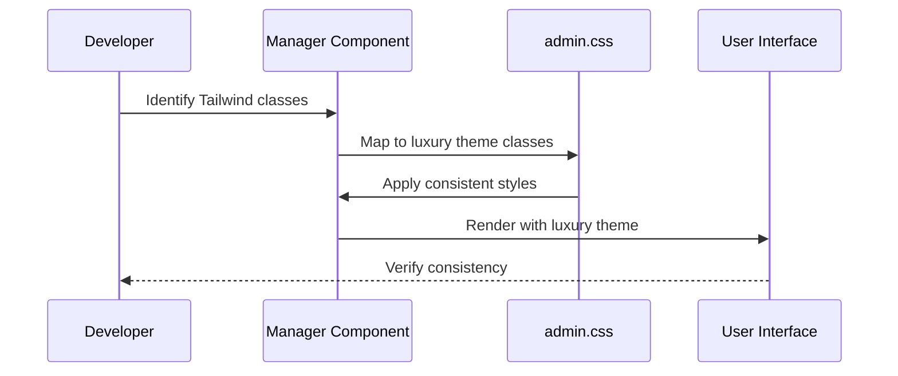
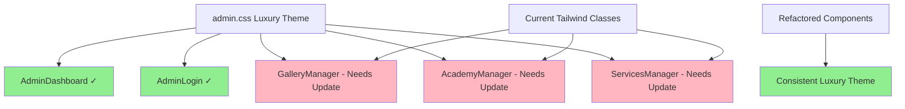

# Design Document: Admin Styling Consistency

## Overview

Refactor the admin manager components (GalleryManager, AcademyManager, ServicesManager) to use the existing luxury royal pink/gold theme styles from admin.css instead of inconsistent Tailwind utility classes. This will create a unified professional admin interface that matches the brand identity already established in AdminDashboard and AdminLogin components.

## Main Algorithm/Workflow



## Architecture



## Components and Interfaces

### Component 1: Style Mapping System

**Purpose**: Map existing Tailwind classes to corresponding admin.css luxury theme classes

**Interface**:
```typescript
interface StyleMapping {
  mapHeaderStyles(tailwindClasses: string[]): string[]
  mapCardStyles(tailwindClasses: string[]): string[]
  mapButtonStyles(tailwindClasses: string[]): string[]
  mapFormStyles(tailwindClasses: string[]): string[]
  mapLayoutStyles(tailwindClasses: string[]): string[]
}
```

**Responsibilities**:
- Identify current Tailwind class usage patterns
- Map to equivalent luxury theme classes
- Maintain responsive behavior
- Preserve functionality while updating aesthetics

### Component 2: Layout Standardization

**Purpose**: Apply consistent layout structure matching AdminDashboard

**Interface**:
```typescript
interface LayoutStructure {
  header: AdminHeaderLayout
  content: AdminContentLayout
  cards: AdminCardLayout
  navigation: AdminNavigationLayout
}

interface AdminHeaderLayout {
  className: "admin-header"
  backgroundGradient: "royal-pink to royal-pink-dark"
  textStyles: "Playfair Display headings"
}

interface AdminContentLayout {
  className: "admin-content"
  maxWidth: "1400px"
  padding: "2rem 1.5rem"
  backgroundGradient: "cream to light pink"
}
```

**Responsibilities**:
- Provide consistent header with royal pink gradient
- Apply luxury background gradients
- Use proper typography hierarchy
- Maintain responsive grid layouts

### Component 3: Card System Standardization

**Purpose**: Replace basic cards with luxury-themed admin cards

**Interface**:
```typescript
interface LuxuryCardSystem {
  adminCard: AdminCardProps
  statCard: StatCardProps
  formCard: FormCardProps
}

interface AdminCardProps {
  className: "admin-card"
  border: "2px solid gold"
  borderRadius: "16px"
  hoverEffects: "translateY(-4px) + shadow"
  gradientBorder: "royal-pink to gold"
}
```

**Responsibilities**:
- Apply gold borders and luxury shadows
- Implement smooth hover animations
- Add gradient border accents
- Maintain card content flexibility

## Data Models

### Model 1: Component Style Configuration

```typescript
interface ComponentStyleConfig {
  component: string                    // e.g., "GalleryManager"
  currentStyles: TailwindClassMap     // Current Tailwind classes
  targetStyles: LuxuryThemeClassMap   // Target luxury theme classes
  layoutStructure: LayoutConfig       // Header, content, navigation
  animations: AnimationConfig         // Fade-in, hover effects
}

interface TailwindClassMap {
  header: string[]       // Current header classes
  buttons: string[]      // Current button classes
  cards: string[]        // Current card classes
  inputs: string[]       // Current form input classes
  layout: string[]       // Current layout classes
}

interface LuxuryThemeClassMap {
  header: string[]       // admin-header, luxury gradients
  buttons: string[]      // btn-primary, btn-secondary, btn-danger
  cards: string[]        // admin-card, stat-card
  inputs: string[]       // admin-input, admin-select, admin-textarea
  layout: string[]       // admin-layout, admin-content
}
```

**Validation Rules**:
- All components must use consistent luxury theme classes
- Responsive behavior must be maintained
- Accessibility attributes must be preserved
- Functionality must remain unchanged

### Model 2: Animation and Interaction Configuration

```typescript
interface InteractionConfig {
  fadeInAnimations: boolean      // Apply fade-in-up animations
  hoverEffects: boolean         // Card hover and button hover effects  
  loadingStates: boolean        // Use luxury spinner styles
  transitionDuration: string    // Consistent 0.3s transitions
  easingFunction: string        // cubic-bezier(0.4, 0, 0.2, 1)
}

interface TypographyConfig {
  headings: "Playfair Display"  // Luxury serif for headings
  body: "Inter"                 // Clean sans-serif for content
  weights: FontWeightMap        // Consistent font weights
  colors: ThemeColorMap         // Royal pink/gold color scheme
}
```

**Validation Rules**:
- Typography hierarchy must follow luxury theme standards
- Color usage must be consistent with royal pink/gold palette
- Animations must be smooth and professional
- Loading states must use luxury spinner design

## Algorithmic Pseudocode

### Main Refactoring Algorithm

```pascal
ALGORITHM refactorAdminComponentStyles(component)
INPUT: component of type AdminComponent
OUTPUT: refactoredComponent of type AdminComponent

BEGIN
  ASSERT component.isManagerComponent() = true
  
  // Step 1: Analyze current styling
  currentStyles ← extractTailwindClasses(component)
  
  // Step 2: Map to luxury theme classes
  luxuryStyles ← mapToLuxuryTheme(currentStyles)
  
  // Step 3: Apply layout structure
  layoutStructure ← applyAdminLayout(component)
  
  // Step 4: Update component structure
  refactoredComponent ← updateComponentStructure(
    component,
    luxuryStyles,
    layoutStructure
  )
  
  // Step 5: Apply animations and interactions
  refactoredComponent ← addLuxuryAnimations(refactoredComponent)
  
  ASSERT refactoredComponent.hasConsistentStyling() = true
  
  RETURN refactoredComponent
END
```

**Preconditions**:
- component is a manager component (Gallery, Academy, or Services)
- admin.css luxury theme styles are available
- Component functionality must be preserved

**Postconditions**:
- Component uses luxury theme classes instead of Tailwind
- Visual consistency matches AdminDashboard and AdminLogin
- All interactive elements have proper hover effects
- Typography follows luxury theme hierarchy

**Loop Invariants**: N/A (no loops in main algorithm)

### Style Mapping Algorithm

```pascal
ALGORITHM mapToLuxuryTheme(tailwindClasses)
INPUT: tailwindClasses of type TailwindClassMap
OUTPUT: luxuryClasses of type LuxuryThemeClassMap

BEGIN
  luxuryClasses ← initializeLuxuryClassMap()
  
  // Map header styles
  FOR each headerClass IN tailwindClasses.header DO
    ASSERT isValidTailwindClass(headerClass) = true
    
    luxuryClass ← mapHeaderClass(headerClass)
    luxuryClasses.header.add(luxuryClass)
  END FOR
  
  // Map button styles with priority handling
  FOR each buttonClass IN tailwindClasses.buttons DO
    buttonType ← determineLuxuryButtonType(buttonClass)
    
    CASE buttonType OF
      primary: luxuryClasses.buttons.add("btn-primary")
      secondary: luxuryClasses.buttons.add("btn-secondary") 
      danger: luxuryClasses.buttons.add("btn-danger")
    END CASE
  END FOR
  
  // Map card styles
  FOR each cardClass IN tailwindClasses.cards DO
    IF isStatisticsCard(cardClass) THEN
      luxuryClasses.cards.add("stat-card")
    ELSE
      luxuryClasses.cards.add("admin-card")
    END IF
  END FOR
  
  ASSERT allClassesMapped(tailwindClasses, luxuryClasses) = true
  
  RETURN luxuryClasses
END
```

**Preconditions**:
- tailwindClasses contains valid Tailwind CSS class names
- Luxury theme class definitions exist in admin.css
- Mapping functions are properly implemented

**Postconditions**:
- All Tailwind classes have corresponding luxury theme mappings
- Button types are correctly categorized (primary/secondary/danger)
- Card types are properly distinguished (admin-card vs stat-card)

**Loop Invariants**:
- All processed classes are valid and have mappings
- Class mapping consistency is maintained throughout iteration

## Key Functions with Formal Specifications

### Function 1: applyAdminLayout()

```typescript
function applyAdminLayout(component: AdminComponent): AdminComponent
```

**Preconditions:**
- `component` is non-null and is a manager component
- `component` has existing JSX structure
- admin.css classes are available in the component

**Postconditions:**
- Returns component with admin-layout structure
- Header uses admin-header class with royal pink gradient
- Content uses admin-content class with proper spacing
- Background gradients match AdminDashboard pattern

**Loop Invariants:** N/A (no loops)

### Function 2: mapButtonClasses()

```typescript  
function mapButtonClasses(tailwindButtonClasses: string[]): string[]
```

**Preconditions:**
- `tailwindButtonClasses` is defined array of strings
- Each string represents a valid Tailwind CSS class

**Postconditions:**
- Returns array of luxury theme button classes
- Primary buttons map to "btn-primary"
- Secondary buttons map to "btn-secondary" 
- Destructive buttons map to "btn-danger"
- Array length is appropriate for button types identified

**Loop Invariants:** 
- For button class processing: All previously processed buttons have valid luxury mappings

### Function 3: preserveComponentFunctionality()

```typescript
function preserveComponentFunctionality(
  original: AdminComponent, 
  refactored: AdminComponent
): boolean
```

**Preconditions:**
- `original` and `refactored` are non-null AdminComponent instances
- Both components have comparable JSX structure
- Event handlers and state management are defined

**Postconditions:**
- Returns true if functionality is preserved
- All event handlers work identically
- Form submissions behave the same
- Data fetching and state updates are unchanged
- Only styling and CSS classes differ between components

**Loop Invariants:**
- For functionality verification loops: All previously checked functions work correctly

## Example Usage

### Example 1: GalleryManager Header Refactoring

```typescript
// Before: Basic Tailwind styling
<header className="bg-white shadow">
  <div className="max-w-7xl mx-auto px-4 sm:px-6 lg:px-8">
    <div className="flex justify-between items-center py-6">
      <h1 className="text-3xl font-bold text-gray-900">Gallery Manager</h1>
    </div>
  </div>
</header>

// After: Luxury theme styling
<header className="admin-header">
  <div style={{ maxWidth: '1400px', margin: '0 auto', padding: '1.5rem 1.5rem' }}>
    <div style={{ display: 'flex', justifyContent: 'space-between', alignItems: 'center' }}>
      <h1 style={{ 
        fontFamily: "'Playfair Display', serif",
        fontSize: '2.25rem', 
        fontWeight: '800', 
        color: '#FFFFFF',
        textShadow: '0 2px 4px rgba(0,0,0,0.1)'
      }}>
        Gallery Manager
      </h1>
    </div>
  </div>
</header>
```

### Example 2: Card Component Refactoring

```typescript
// Before: Basic Tailwind card
<div className="bg-white rounded-lg shadow overflow-hidden">
  <div className="p-4">
    <h3 className="font-medium text-gray-900">{item.name}</h3>
    <p className="text-sm text-gray-500">{item.category}</p>
  </div>
</div>

// After: Luxury theme card
<div className="admin-card fade-in-up">
  <div>
    <h3 style={{ 
      fontFamily: "'Playfair Display', serif",
      fontSize: '1.375rem', 
      fontWeight: '700', 
      color: '#0F172A'
    }}>
      {item.name}
    </h3>
    <p className="stat-label">{item.category}</p>
  </div>
</div>
```

### Example 3: Button System Refactoring

```typescript
// Before: Mixed Tailwind button styles
<button className="px-4 py-2 bg-pink-600 text-white rounded-md hover:bg-pink-700">
  Add New Service
</button>
<button className="px-4 py-2 bg-blue-100 text-blue-700 rounded-md hover:bg-blue-200">
  Edit
</button>
<button className="px-4 py-2 bg-red-100 text-red-700 rounded-md hover:bg-red-200">
  Delete
</button>

// After: Consistent luxury theme buttons
<button className="btn-primary">
  Add New Service
</button>
<button className="btn-secondary">
  Edit
</button>
<button className="btn-danger">
  Delete
</button>
```

## Correctness Properties

*A property is a characteristic or behavior that should hold true across all valid executions of a system-essentially, a formal statement about what the system should do. Properties serve as the bridge between human-readable specifications and machine-verifiable correctness guarantees.*

### Property 1: Layout Structure Consistency

*For any* manager component, the main container should use admin-layout class and content area should use admin-content class with luxury background gradients.

**Validates: Requirements 2.1, 2.2, 2.4**

### Property 2: Card Styling Uniformity

*For any* card element in manager components, it should use admin-card or stat-card classes instead of Tailwind utility classes.

**Validates: Requirements 3.1**

### Property 3: Button Classification Consistency

*For any* button element, it should use appropriate luxury theme classes (btn-primary, btn-secondary, btn-danger) based on its function and styling intent.

**Validates: Requirements 4.1, 4.2, 4.3**

### Property 4: Form Element Theme Compliance

*For any* form input, select, or textarea element, it should use corresponding luxury theme classes (admin-input, admin-select, admin-textarea) instead of Tailwind classes.

**Validates: Requirements 5.1, 5.2, 5.3**

### Property 5: Typography Hierarchy Consistency

*For any* text element, section headings should use section-header class, statistical values should use stat-value class, and labels should use stat-label class following the luxury typography hierarchy.

**Validates: Requirements 6.1, 6.4, 6.5**

### Property 6: Interactive Element Hover Effects

*For any* interactive element (buttons, cards, form fields), hovering should apply luxury theme hover effects with proper transitions and styling.

**Validates: Requirements 3.4, 4.4, 5.4**

### Property 7: Loading State Consistency

*For any* loading state in manager components, it should use luxury spinner classes and maintain royal pink/gold color scheme.

**Validates: Requirements 7.1, 7.2**

### Property 8: Animation Application Consistency

*For any* appropriate element in manager components, fade-in-up animations should be applied where suitable to match luxury theme standards.

**Validates: Requirements 7.3, 7.5**

### Property 9: Badge and Status Styling

*For any* status badge element, it should use appropriate luxury theme badge classes and maintain color scheme consistency with royal pink/gold theme.

**Validates: Requirements 10.1, 10.4**

### Property 10: Functionality Preservation During Refactoring

*For any* existing functionality (form submissions, data fetching, state management, user interactions), the behavior should remain identical to the original implementation after styling refactoring.

**Validates: Requirements 11.1, 11.2, 11.3, 11.4, 11.5**

### Property 11: Font Family Application Consistency

*For any* text element, body text should use Inter font family and headings should use Playfair Display font family according to luxury theme typography standards.

**Validates: Requirements 6.3, 6.1**

### Property 12: Transition and Animation Timing

*For any* animated element (cards, buttons), transitions should use 0.3s duration with cubic-bezier easing for consistent luxury theme timing.

**Validates: Requirements 3.5, 4.5**

## Error Handling

### Error Scenario 1: Missing Luxury Theme Classes

**Condition**: When a Tailwind class has no direct luxury theme equivalent
**Response**: Use closest semantic luxury theme class or create inline styles that match luxury theme patterns
**Recovery**: Document custom styles and consider adding them to admin.css for future use

### Error Scenario 2: Broken Responsive Behavior

**Condition**: When luxury theme classes break responsive design
**Response**: Combine luxury theme classes with necessary responsive utilities
**Recovery**: Test on all breakpoints and adjust class combinations as needed

### Error Scenario 3: Functionality Regression

**Condition**: When styling changes break existing component functionality  
**Response**: Revert problematic changes and find alternative styling approach
**Recovery**: Isolate styling changes from functional code and test incrementally

## Testing Strategy

### Unit Testing Approach

Focus on functionality preservation testing:
- Form submission behavior remains unchanged
- Data fetching and state updates work correctly  
- User interactions trigger appropriate responses
- Component props and callbacks function identically

### Property-Based Testing Approach

**Property Test Library**: Jest with React Testing Library

Generate various component states and verify:
- All luxury theme classes are applied correctly
- Visual consistency is maintained across different data sets
- Responsive behavior works across viewport sizes
- Typography hierarchy is preserved

### Integration Testing Approach

Test complete admin workflow:
- Navigation between manager components maintains visual consistency
- User sessions work seamlessly across all refactored components
- Overall admin experience feels cohesive and professional

## Performance Considerations

- Luxury theme CSS is already loaded, so no additional network requests
- Inline styles used sparingly only where necessary for dynamic values
- Animation performance optimized using CSS transforms and opacity
- Image and asset loading remains unchanged

## Security Considerations

- No changes to authentication or authorization logic
- Form validation and data sanitization remain unchanged  
- All security measures in existing components are preserved
- No new security vulnerabilities introduced through styling changes

## Dependencies

- Existing admin.css luxury theme styles (already available)
- React and JSX support for component refactoring
- Existing component functionality and structure
- Google Fonts for Playfair Display and Inter (already imported)
- No new external dependencies required