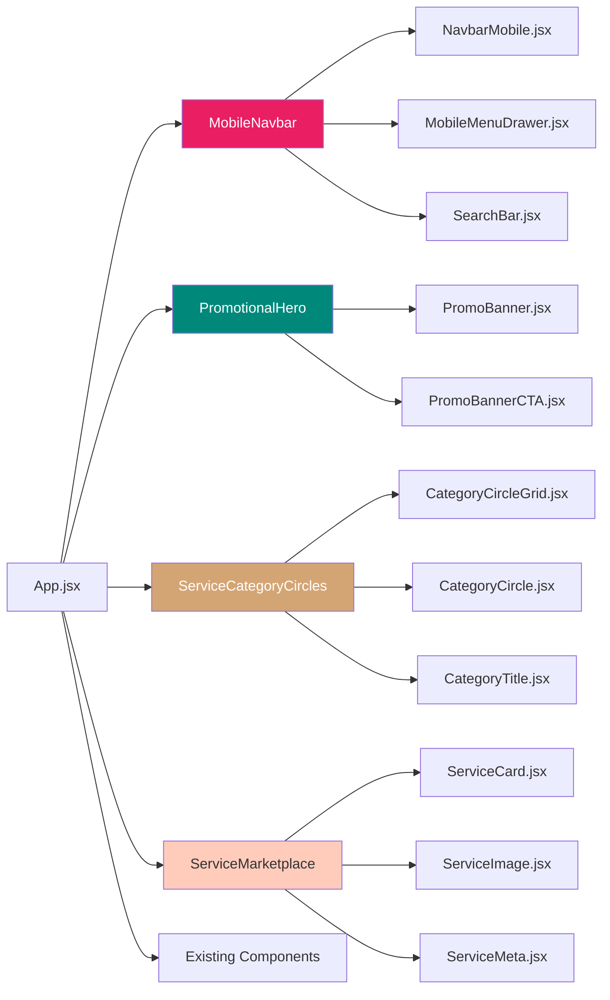
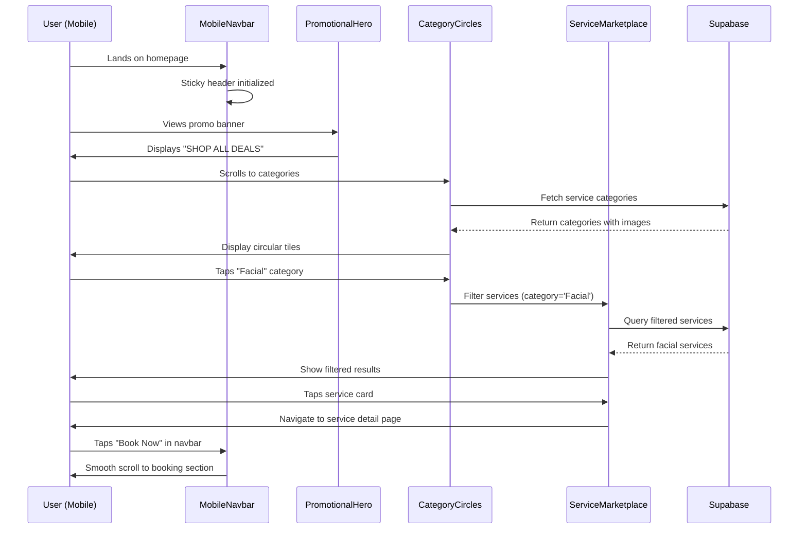

# Design Document: Mobile-First Beauty Marketplace Redesign

## Overview

This design transforms the Sree Maguva website into a premium mobile-first beauty marketplace inspired by modern e-commerce UX patterns. The redesign prioritizes thumb-friendly navigation, circular service categories, promotional banners, and a clean white aesthetic while preserving all existing functionality (Supabase integration, admin dashboard, reviews, booking).

The transformation focuses on the customer-facing homepage and Services section, converting the traditional service list into an engaging marketplace with:
- **Sticky mobile-optimized header** with centered logo and menu icons
- **Large promotional hero banner** with "SHOP ALL DEALS" CTA
- **"What are you looking for?" section** with circular category tiles and emoji
- **Service cards grid** optimized for 2-column mobile layout
- **Generous white space** and thumb-friendly touch targets
- **Premium beauty photography** with professional aesthetic

**Core Principle**: Mobile-first design that scales up to desktop, not desktop design that shrinks down.

## Architecture

### System Overview

```mermaid
graph TD
    A[Mobile-First Homepage] --> B[Sticky Header]
    A --> C[Hero Promotional Banner]
    A --> D[Service Category Circles]
    A --> E[Service Marketplace Grid]
    A --> F[Existing Sections]
    
    B --> B1[Centered Logo]
    B --> B2[Left: Menu Icon]
    B --> B3[Right: Search/Cart Icons]
    
    C --> C1[Large Banner Image]
    C --> C2[Promotional Text]
    C --> C3[CTA Button]
    
    D --> D1[Section Title with Emoji]
    D --> D2[Circular Category Images]
    D --> D3[Category Labels]
    
    E --> E1[Service Cards - 2 Col Mobile]
    E --> E2[Service Images]
    E --> E3[Pricing & CTA]
    
    F --> F1[About Section - Preserved]
    F --> F2[Academy Section - Preserved]
    F --> F3[Gallery - Preserved]
    F --> F4[Reviews - Preserved]
    F --> F5[Booking - Preserved]
    F --> F6[Location - Preserved]
    
    subgraph "Supabase Backend - Unchanged"
        G[Services Table]
        H[Gallery Table]
        I[Academy Table]
        J[Reviews Table]
    end
    
    E1 --> G
    D2 --> G
```



### Component Architecture



### Data Flow Sequence



## Components and Interfaces

### Component 1: MobileNavbar

**Purpose**: Sticky mobile-first navigation header with centered logo and icon-based navigation

**Interface**:
```typescript
interface MobileNavbarProps {
  isSticky?: boolean;
  logoSrc: string;
  onMenuClick: () => void;
  onSearchClick: () => void;
  onCartClick?: () => void;
  showCart?: boolean;
}

interface NavbarState {
  scrolled: boolean;
  menuOpen: boolean;
  searchOpen: boolean;
}
```

**Responsibilities**:
- Render sticky header that appears on scroll
- Display centered logo with left/right icon buttons
- Handle menu drawer toggle
- Handle search overlay toggle
- Maintain scroll state for styling transitions
- Provide mobile-optimized touch targets (min 44x44px)

**Key Behaviors**:
- Header becomes sticky after 100px scroll
- Logo scales down slightly when scrolled
- Icons have ripple effect on tap
- Menu drawer slides from left
- Search bar expands from top


---

### Component 2: PromotionalHero

**Purpose**: Large promotional banner section with image, text overlay, and primary CTA

**Interface**:
```typescript
interface PromotionalHeroProps {
  bannerImage: string;
  bannerImageAlt: string;
  title: string;
  subtitle?: string;
  ctaText: string;
  ctaLink: string;
  onCtaClick?: () => void;
  overlayOpacity?: number;
  textColor?: 'light' | 'dark';
}

interface BannerMetrics {
  impressions: number;
  clicks: number;
  ctr: number;
}
```

**Responsibilities**:
- Display full-width promotional banner
- Render overlay gradient for text readability
- Show compelling CTA button
- Handle banner click tracking (optional analytics)
- Lazy load banner image for performance
- Provide fallback image if primary fails

**Key Behaviors**:
- Banner height: 60vh on mobile, 50vh on desktop
- Text overlay with gradient background
- CTA button pulses with subtle animation
- Image loads progressively with blur-up effect
- Tapping anywhere on banner triggers CTA (mobile only)


---

### Component 3: ServiceCategoryCircles

**Purpose**: "What are you looking for?" section with circular category tiles

**Interface**:
```typescript
interface ServiceCategoryCirclesProps {
  title: string;
  emoji?: string;
  categories: ServiceCategory[];
  columns?: { mobile: number; tablet: number; desktop: number };
  onCategorySelect: (categoryId: string) => void;
}

interface ServiceCategory {
  id: string;
  name: string;
  image: string;
  icon?: string;
  servicesCount?: number;
  popularityRank?: number;
}

interface CategoryCircleProps {
  category: ServiceCategory;
  size?: 'small' | 'medium' | 'large';
  onClick: () => void;
  isActive?: boolean;
}
```

**Responsibilities**:
- Render section title with emoji ("What are you looking for, Bestie? 👀")
- Display grid of circular category images
- Handle category selection/filtering
- Show category labels below circles
- Provide visual feedback on tap
- Support horizontal scroll on mobile if needed

**Key Behaviors**:
- Circles are perfect circles (1:1 aspect ratio)
- Images use object-fit: cover
- Active category has colored border
- Smooth scroll to service section on tap
- Grid: 3 columns mobile, 4 tablet, 6 desktop
- Circle diameter: 100px mobile, 120px tablet, 140px desktop
