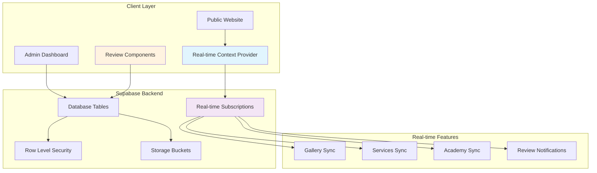
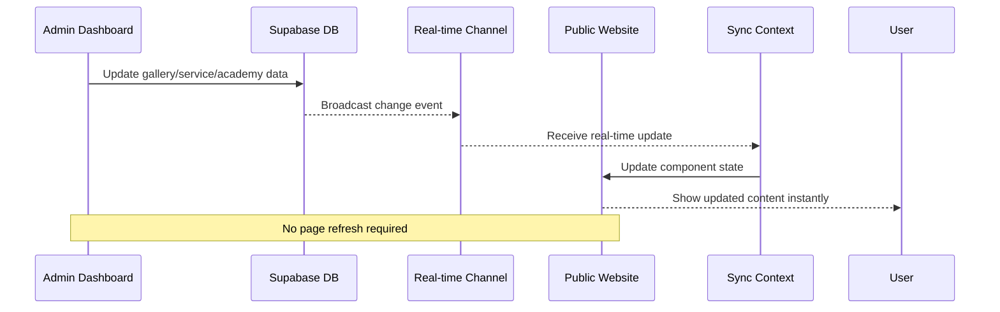
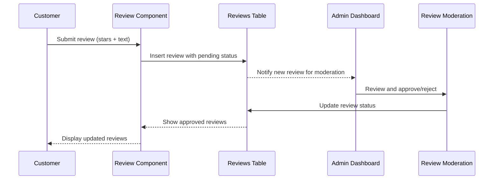

# Design Document: Real-time Data Synchronization and Customer Review System

## Overview

This design encompasses two critical features for the Sree Maguva beauty website: **Real-time Data Synchronization** and **Customer Review System**. The real-time sync ensures admin changes to gallery, services, and academy content instantly reflect on the public website using Supabase's real-time subscriptions. The review system enables customers to provide feedback with star ratings and text reviews, enhancing credibility and user engagement.

Both features integrate seamlessly with the existing React + Supabase architecture, maintaining the luxury royal pink/gold aesthetic while providing enterprise-grade functionality.

## Architecture Overview



## Sequence Diagrams

### Real-time Data Synchronization Flow



### Customer Review System Flow



## Core Data Models

### Real-time Synchronization Types

```typescript
// Real-time event types for different data operations
interface RealtimeEvent<T = any> {
  eventType: 'INSERT' | 'UPDATE' | 'DELETE'
  table: string
  schema: string
  old: T | null
  new: T | null
  commit_timestamp: string
}

// Supported sync data types
interface SyncDataTypes {
  gallery_items: GalleryItem
  services: Service  
  academy_courses: AcademyCourse
  course_schedules: CourseSchedule
  reviews: CustomerReview
}

// Real-time context state
interface RealtimeSyncState {
  isConnected: boolean
  subscriptions: Map<string, RealtimeChannel>
  lastSync: Record<string, Date>
  syncErrors: Record<string, string>
}
```

### Customer Review System Types

```typescript
// Customer review data model
interface CustomerReview {
  id: string
  customer_name: string | null
  email: string | null
  rating: 1 | 2 | 3 | 4 | 5
  review_text: string
  service_category?: string
  status: 'pending' | 'approved' | 'rejected'
  is_featured: boolean
  created_at: string
  updated_at: string
  approved_at?: string
  approved_by?: string
}

// Review form data
interface ReviewFormData {
  customer_name?: string
  email?: string
  rating: number
  review_text: string
  service_category?: string
}

// Review statistics
interface ReviewStats {
  total_reviews: number
  average_rating: number
  rating_distribution: Record<1 | 2 | 3 | 4 | 5, number>
  featured_count: number
}
```

## Real-time Synchronization Implementation

### Real-time Context Provider

```typescript
// Real-time synchronization context for managing live updates
import { createContext, useContext, useEffect, useState, useCallback, ReactNode } from 'react'
import { supabase } from '../lib/supabase'
import { RealtimeChannel } from '@supabase/supabase-js'

interface RealtimeSyncContextType {
  isConnected: boolean
  subscribeToTable: (table: string, callback: (payload: any) => void) => void
  unsubscribeFromTable: (table: string) => void
  getConnectionStatus: () => boolean
  reconnect: () => Promise<void>
}

const RealtimeSyncContext = createContext<RealtimeSyncContextType | null>(null)

interface RealtimeSyncProviderProps {
  children: ReactNode
  enabledTables?: string[]
}

export const RealtimeSyncProvider = ({ 
  children, 
  enabledTables = ['gallery_items', 'services', 'academy_courses', 'course_schedules', 'reviews']
}: RealtimeSyncProviderProps) => {
  const [isConnected, setIsConnected] = useState(false)
  const [subscriptions] = useState(new Map<string, RealtimeChannel>())

  const subscribeToTable = useCallback((table: string, callback: (payload: any) => void) => {
    if (subscriptions.has(table)) {
      console.warn(`Already subscribed to table: ${table}`)
      return
    }

    const channel = supabase
      .channel(`public:${table}`)
      .on('postgres_changes', 
        { 
          event: '*', 
          schema: 'public', 
          table: table 
        }, 
        callback
      )
      .subscribe((status) => {
        if (status === 'SUBSCRIBED') {
          setIsConnected(true)
          console.log(`✅ Subscribed to ${table} real-time updates`)
        } else if (status === 'CHANNEL_ERROR') {
          setIsConnected(false)
          console.error(`❌ Failed to subscribe to ${table}`)
        }
      })

    subscriptions.set(table, channel)
  }, [subscriptions])

  const unsubscribeFromTable = useCallback((table: string) => {
    const channel = subscriptions.get(table)
    if (channel) {
      supabase.removeChannel(channel)
      subscriptions.delete(table)
      console.log(`🔌 Unsubscribed from ${table}`)
    }
  }, [subscriptions])

  const reconnect = useCallback(async () => {
    // Unsubscribe from all channels
    subscriptions.forEach((channel, table) => {
      supabase.removeChannel(channel)
    })
    subscriptions.clear()
    
    // Wait a bit before reconnecting
    await new Promise(resolve => setTimeout(resolve, 1000))
    
    // Re-establish connections would be handled by individual components
    setIsConnected(false)
  }, [subscriptions])

  const getConnectionStatus = useCallback(() => isConnected, [isConnected])

  // Cleanup on unmount
  useEffect(() => {
    return () => {
      subscriptions.forEach((channel) => {
        supabase.removeChannel(channel)
      })
      subscriptions.clear()
    }
  }, [subscriptions])

  const value: RealtimeSyncContextType = {
    isConnected,
    subscribeToTable,
    unsubscribeFromTable,
    getConnectionStatus,
    reconnect
  }

  return (
    <RealtimeSyncContext.Provider value={value}>
      {children}
    </RealtimeSyncContext.Provider>
  )
}

export const useRealtimeSync = (): RealtimeSyncContextType => {
  const context = useContext(RealtimeSyncContext)
  if (!context) {
    throw new Error('useRealtimeSync must be used within RealtimeSyncProvider')
  }
  return context
}
```
### Enhanced Gallery Component with Real-time Sync

```typescript
// Enhanced Gallery component with real-time synchronization
import { useState, useEffect, useCallback } from 'react'
import { supabase, TABLES } from '../lib/supabase'
import { useRealtimeSync } from '../contexts/RealtimeSyncContext'
import SectionTitle from '../components/SectionTitle'
import './Gallery.css'

interface GalleryItem {
  id: string
  url: string
  alt: string
  category: string
  type: 'image' | 'video'
  created_at: string
}

const EnhancedGallery = () => {
  const [filter, setFilter] = useState('All')
  const [lightbox, setLightbox] = useState({ open: false, index: 0 })
  const [galleryImages, setGalleryImages] = useState<GalleryItem[]>([])
  const [loading, setLoading] = useState(true)
  const [syncStatus, setSyncStatus] = useState<'synced' | 'syncing' | 'error'>('synced')
  
  const { subscribeToTable, unsubscribeFromTable, isConnected } = useRealtimeSync()

  // Handle real-time updates
  const handleRealtimeUpdate = useCallback((payload: any) => {
    setSyncStatus('syncing')
    
    const { eventType, new: newRecord, old: oldRecord } = payload
    
    setGalleryImages(currentImages => {
      let updatedImages = [...currentImages]
      
      switch (eventType) {
        case 'INSERT':
          if (newRecord) {
            const newItem: GalleryItem = {
              id: newRecord.id,
              url: newRecord.url,
              alt: newRecord.alt,
              category: newRecord.category,
              type: newRecord.type,
              created_at: newRecord.created_at
            }
            updatedImages = [newItem, ...updatedImages]
          }
          break
          
        case 'UPDATE':
          if (newRecord) {
            const index = updatedImages.findIndex(img => img.id === newRecord.id)
            if (index !== -1) {
              updatedImages[index] = {
                id: newRecord.id,
                url: newRecord.url,
                alt: newRecord.alt,
                category: newRecord.category,
                type: newRecord.type,
                created_at: newRecord.created_at
              }
            }
          }
          break
          
        case 'DELETE':
          if (oldRecord) {
            updatedImages = updatedImages.filter(img => img.id !== oldRecord.id)
          }
          break
      }
      
      // Sort by creation date (newest first)
      return updatedImages.sort((a, b) => 
        new Date(b.created_at).getTime() - new Date(a.created_at).getTime()
      )
    })
    
    // Show sync confirmation briefly
    setTimeout(() => setSyncStatus('synced'), 500)
  }, [])

  useEffect(() => {
    fetchGalleryImages()
    
    // Subscribe to real-time updates
    subscribeToTable(TABLES.GALLERY_ITEMS, handleRealtimeUpdate)
    
    // Cleanup subscription on unmount
    return () => {
      unsubscribeFromTable(TABLES.GALLERY_ITEMS)
    }
  }, [subscribeToTable, unsubscribeFromTable, handleRealtimeUpdate])

  const fetchGalleryImages = async () => {
    try {
      setLoading(true)
      const { data, error } = await supabase
        .from(TABLES.GALLERY_ITEMS)
        .select('*')
        .order('created_at', { ascending: false })

      if (error) throw error

      const formattedImages: GalleryItem[] = (data || []).map(item => ({
        id: item.id,
        url: item.url,
        alt: item.alt,
        category: item.category,
        type: item.type,
        created_at: item.created_at
      }))

      setGalleryImages(formattedImages)
    } catch (error) {
      console.error('Error fetching gallery:', error)
      setSyncStatus('error')
    } finally {
      setLoading(false)
    }
  }

  const categories = ['All', ...new Set(galleryImages.map(img => img.category))]
  const filteredImages = filter === 'All' 
    ? galleryImages 
    : galleryImages.filter(img => img.category === filter)

  const openLightbox = (index: number) => {
    setLightbox({ open: true, index })
  }

  const closeLightbox = () => {
    setLightbox({ open: false, index: 0 })
  }

  const navigate = (direction: 'next' | 'prev') => {
    const newIndex = direction === 'next'
      ? (lightbox.index + 1) % filteredImages.length
      : (lightbox.index - 1 + filteredImages.length) % filteredImages.length
    setLightbox({ ...lightbox, index: newIndex })
  }

  return (
    <section id="gallery" className="gallery section">
      <div className="container">
        <SectionTitle 
          small="OUR WORK"
          title="Beauty That Speaks for Itself"
          subtitle="Explore our portfolio of transformations and satisfied clients"
        />

        {/* Real-time sync status indicator */}
        <div className="sync-status-indicator">
          <span className={`sync-dot ${syncStatus}`}></span>
          <span className="sync-text">
            {isConnected ? (
              syncStatus === 'syncing' ? 'Updating...' : 'Live'
            ) : 'Offline'}
          </span>
        </div>

        {/* Filter */}
        <div className="gallery-filter">
          {categories.map(category => (
            <button
              key={category}
              className={`filter-btn ${filter === category ? 'active' : ''}`}
              onClick={() => setFilter(category)}
            >
              {category}
            </button>
          ))}
        </div>

        {/* Gallery Grid */}
        {loading ? (
          <div className="loading-state">
            <div className="spinner"></div>
            <p>Loading gallery...</p>
          </div>
        ) : galleryImages.length === 0 ? (
          <div className="empty-state">
            <p>No images in the gallery yet.</p>
          </div>
        ) : (
          <div className="gallery-grid">
            {filteredImages.map((image, index) => (
              <div 
                className="gallery-item" 
                key={image.id}
                onClick={() => openLightbox(index)}
              >
                {image.type === 'video' ? (
                  <video src={image.url} poster={image.url} muted />
                ) : (
                  
                )}
                <div className="gallery-overlay">
                  <span className="gallery-icon">
                    {image.type === 'video' ? '▶️' : '🔍'}
                  </span>
                  <span className="gallery-category">{image.category}</span>
                </div>
              </div>
            ))}
          </div>
        )}
      </div>

      {/* Enhanced Lightbox with video support */}
      {lightbox.open && filteredImages[lightbox.index] && (
        <div className="lightbox" onClick={closeLightbox}>
          <button className="lightbox-close" onClick={closeLightbox}>✕</button>
          <button className="lightbox-nav lightbox-prev" 
                  onClick={(e) => { e.stopPropagation(); navigate('prev'); }}>‹</button>
          <button className="lightbox-nav lightbox-next"
                  onClick={(e) => { e.stopPropagation(); navigate('next'); }}>›</button>
          
          <div className="lightbox-content" onClick={(e) => e.stopPropagation()}>
            {filteredImages[lightbox.index].type === 'video' ? (
              <video 
                src={filteredImages[lightbox.index].url} 
                controls 
                autoPlay 
                muted
              />
            ) : (
              
            )}
            <p className="lightbox-caption">
              {filteredImages[lightbox.index].alt}
            </p>
          </div>
        </div>
      )}
    </section>
  )
}

export default EnhancedGallery
```
## Customer Review System Implementation

### Database Schema Extension

```sql
-- Customer Reviews Table
CREATE TABLE IF NOT EXISTS customer_reviews (
    id UUID DEFAULT uuid_generate_v4() PRIMARY KEY,
    customer_name TEXT,
    email TEXT,
    rating INTEGER NOT NULL CHECK (rating >= 1 AND rating <= 5),
    review_text TEXT NOT NULL CHECK (char_length(review_text) >= 10),
    service_category TEXT,
    status TEXT NOT NULL DEFAULT 'pending' CHECK (status IN ('pending', 'approved', 'rejected')),
    is_featured BOOLEAN NOT NULL DEFAULT FALSE,
    ip_address INET,
    user_agent TEXT,
    created_at TIMESTAMP WITH TIME ZONE DEFAULT NOW(),
    updated_at TIMESTAMP WITH TIME ZONE DEFAULT NOW(),
    approved_at TIMESTAMP WITH TIME ZONE,
    approved_by TEXT,
    
    -- Prevent spam: one review per email per day
    CONSTRAINT unique_email_per_day UNIQUE (email, DATE(created_at))
);

-- Indexes for performance
CREATE INDEX IF NOT EXISTS idx_customer_reviews_status ON customer_reviews(status);
CREATE INDEX IF NOT EXISTS idx_customer_reviews_rating ON customer_reviews(rating);
CREATE INDEX IF NOT EXISTS idx_customer_reviews_featured ON customer_reviews(is_featured);
CREATE INDEX IF NOT EXISTS idx_customer_reviews_created_at ON customer_reviews(created_at DESC);
CREATE INDEX IF NOT EXISTS idx_customer_reviews_service_category ON customer_reviews(service_category);

-- Enable RLS
ALTER TABLE customer_reviews ENABLE ROW LEVEL SECURITY;

-- Public can read approved reviews
CREATE POLICY "Allow public read access to approved reviews" ON customer_reviews
    FOR SELECT USING (status = 'approved');

-- Public can insert reviews (for submission)
CREATE POLICY "Allow public insert reviews" ON customer_reviews
    FOR INSERT WITH CHECK (true);

-- Admin has full access
CREATE POLICY "Allow admin full access to reviews" ON customer_reviews
    FOR ALL USING (auth.jwt() ->> 'email' = 'jaanu@gmail.com');

-- Auto-update timestamp trigger
CREATE TRIGGER update_customer_reviews_updated_at BEFORE UPDATE ON customer_reviews 
    FOR EACH ROW EXECUTE FUNCTION update_updated_at_column();

-- Review statistics view
CREATE OR REPLACE VIEW review_statistics AS
SELECT 
    COUNT(*) as total_reviews,
    ROUND(AVG(rating), 2) as average_rating,
    COUNT(*) FILTER (WHERE rating = 5) as five_star_count,
    COUNT(*) FILTER (WHERE rating = 4) as four_star_count,
    COUNT(*) FILTER (WHERE rating = 3) as three_star_count,
    COUNT(*) FILTER (WHERE rating = 2) as two_star_count,
    COUNT(*) FILTER (WHERE rating = 1) as one_star_count,
    COUNT(*) FILTER (WHERE is_featured = true) as featured_count
FROM customer_reviews 
WHERE status = 'approved';
```

### Star Rating Component

```typescript
// Reusable star rating component with luxury styling
import { useState } from 'react'
import './StarRating.css'

interface StarRatingProps {
  rating: number
  onRatingChange?: (rating: number) => void
  readonly?: boolean
  size?: 'small' | 'medium' | 'large'
  showValue?: boolean
  className?: string
}

const StarRating = ({ 
  rating, 
  onRatingChange, 
  readonly = false, 
  size = 'medium',
  showValue = false,
  className = ''
}: StarRatingProps) => {
  const [hoverRating, setHoverRating] = useState<number>(0)
  
  const handleStarClick = (starRating: number) => {
    if (!readonly && onRatingChange) {
      onRatingChange(starRating)
    }
  }
  
  const handleStarHover = (starRating: number) => {
    if (!readonly) {
      setHoverRating(starRating)
    }
  }
  
  const handleStarLeave = () => {
    if (!readonly) {
      setHoverRating(0)
    }
  }
  
  const displayRating = hoverRating || rating
  
  return (
    <div className={`star-rating ${size} ${readonly ? 'readonly' : ''} ${className}`}>
      <div className="stars-container">
        {[1, 2, 3, 4, 5].map((star) => (
          <button
            key={star}
            type="button"
            className={`star ${star <= displayRating ? 'active' : ''}`}
            onClick={() => handleStarClick(star)}
            onMouseEnter={() => handleStarHover(star)}
            onMouseLeave={handleStarLeave}
            disabled={readonly}
            aria-label={`${star} star${star !== 1 ? 's' : ''}`}
          >
            <svg viewBox="0 0 24 24" fill="currentColor">
              <path d="M12 2l3.09 6.26L22 9.27l-5 4.87 1.18 6.88L12 17.77l-6.18 3.25L7 14.14 2 9.27l6.91-1.01L12 2z"/>
            </svg>
          </button>
        ))}
      </div>
      
      {showValue && (
        <span className="rating-value">
          {displayRating}/5
        </span>
      )}
    </div>
  )
}

export default StarRating
```

### Customer Review Form Component

```typescript
// Customer review submission form
import { useState, FormEvent } from 'react'
import { supabase } from '../lib/supabase'
import StarRating from './StarRating'
import Button from './Button'
import './ReviewForm.css'

interface ReviewFormProps {
  onSubmitSuccess?: () => void
  onSubmitError?: (error: string) => void
  className?: string
}

const CustomerReviewForm = ({ 
  onSubmitSuccess, 
  onSubmitError,
  className = '' 
}: ReviewFormProps) => {
  const [formData, setFormData] = useState({
    customer_name: '',
    email: '',
    rating: 0,
    review_text: '',
    service_category: ''
  })
  
  const [isSubmitting, setIsSubmitting] = useState(false)
  const [isSuccess, setIsSuccess] = useState(false)
  const [errors, setErrors] = useState<Record<string, string>>({})

  const serviceCategories = [
    'Bridal Makeup',
    'Party Makeup', 
    'Hair Styling',
    'Skincare Treatment',
    'Academy Course',
    'Other'
  ]

  const validateForm = (): boolean => {
    const newErrors: Record<string, string> = {}

    if (formData.rating === 0) {
      newErrors.rating = 'Please select a rating'
    }

    if (formData.review_text.trim().length < 10) {
      newErrors.review_text = 'Review must be at least 10 characters long'
    }

    if (formData.review_text.trim().length > 500) {
      newErrors.review_text = 'Review must be less than 500 characters'
    }

    if (formData.email && !/\S+@\S+\.\S+/.test(formData.email)) {
      newErrors.email = 'Please enter a valid email address'
    }

    setErrors(newErrors)
    return Object.keys(newErrors).length === 0
  }

  const handleSubmit = async (e: FormEvent) => {
    e.preventDefault()
    
    if (!validateForm()) {
      return
    }

    setIsSubmitting(true)
    setErrors({})

    try {
      const reviewData = {
        customer_name: formData.customer_name.trim() || null,
        email: formData.email.trim() || null,
        rating: formData.rating,
        review_text: formData.review_text.trim(),
        service_category: formData.service_category || null,
        status: 'pending',
        ip_address: null, // Could be populated by edge function
        user_agent: navigator.userAgent
      }

      const { error } = await supabase
        .from('customer_reviews')
        .insert([reviewData])

      if (error) {
        if (error.code === '23505') { // Unique constraint violation
          throw new Error('You can only submit one review per day. Please try again tomorrow.')
        }
        throw error
      }

      setIsSuccess(true)
      
      // Reset form
      setFormData({
        customer_name: '',
        email: '',
        rating: 0,
        review_text: '',
        service_category: ''
      })

      onSubmitSuccess?.()

    } catch (error: any) {
      console.error('Error submitting review:', error)
      const errorMessage = error.message || 'Failed to submit review. Please try again.'
      setErrors({ submit: errorMessage })
      onSubmitError?.(errorMessage)
    } finally {
      setIsSubmitting(false)
    }
  }

  if (isSuccess) {
    return (
      <div className={`review-form-success ${className}`}>
        <div className="success-icon">✅</div>
        <h3>Thank you for your review!</h3>
        <p>Your review has been submitted and is pending approval. It will appear on the website once approved by our team.</p>
        <Button 
          variant="outline" 
          onClick={() => {
            setIsSuccess(false)
            setFormData({
              customer_name: '',
              email: '',
              rating: 0,
              review_text: '',
              service_category: ''
            })
          }}
        >
          Submit Another Review
        </Button>
      </div>
    )
  }

  return (
    <form className={`customer-review-form ${className}`} onSubmit={handleSubmit}>
      <div className="form-header">
        <h3>Share Your Experience</h3>
        <p>Your feedback helps us improve and helps other customers make informed decisions.</p>
      </div>

      {/* Rating */}
      <div className="form-group">
        <label className="form-label">
          Overall Rating <span className="required">*</span>
        </label>
        <StarRating
          rating={formData.rating}
          onRatingChange={(rating) => setFormData(prev => ({ ...prev, rating }))}
          size="large"
          showValue
        />
        {errors.rating && <span className="error-message">{errors.rating}</span>}
      </div>

      {/* Service Category */}
      <div className="form-group">
        <label htmlFor="service_category" className="form-label">
          Service Category (Optional)
        </label>
        <select
          id="service_category"
          value={formData.service_category}
          onChange={(e) => setFormData(prev => ({ ...prev, service_category: e.target.value }))}
          className="form-select"
        >
          <option value="">Select a service...</option>
          {serviceCategories.map(category => (
            <option key={category} value={category}>{category}</option>
          ))}
        </select>
      </div>

      {/* Review Text */}
      <div className="form-group">
        <label htmlFor="review_text" className="form-label">
          Your Review <span className="required">*</span>
        </label>
        <textarea
          id="review_text"
          value={formData.review_text}
          onChange={(e) => setFormData(prev => ({ ...prev, review_text: e.target.value }))}
          placeholder="Share your experience with us... (minimum 10 characters)"
          className="form-textarea"
          rows={4}
          maxLength={500}
        />
        <div className="character-count">
          {formData.review_text.length}/500 characters
        </div>
        {errors.review_text && <span className="error-message">{errors.review_text}</span>}
      </div>

      {/* Customer Name */}
      <div className="form-group">
        <label htmlFor="customer_name" className="form-label">
          Your Name (Optional)
        </label>
        <input
          type="text"
          id="customer_name"
          value={formData.customer_name}
          onChange={(e) => setFormData(prev => ({ ...prev, customer_name: e.target.value }))}
          placeholder="Leave blank to review anonymously"
          className="form-input"
          maxLength={100}
        />
        <small className="form-help">Leave blank if you'd prefer to review anonymously</small>
      </div>

      {/* Email */}
      <div className="form-group">
        <label htmlFor="email" className="form-label">
          Email (Optional)
        </label>
        <input
          type="email"
          id="email"
          value={formData.email}
          onChange={(e) => setFormData(prev => ({ ...prev, email: e.target.value }))}
          placeholder="your@email.com"
          className="form-input"
        />
        <small className="form-help">For follow-up purposes only. Will not be displayed publicly.</small>
      </div>

      {/* Submit Error */}
      {errors.submit && (
        <div className="error-message submit-error">
          {errors.submit}
        </div>
      )}

      {/* Submit Button */}
      <div className="form-actions">
        <Button
          type="submit"
          variant="primary"
          size="large"
          disabled={isSubmitting}
          className="submit-button"
        >
          {isSubmitting ? (
            <>
              <span className="loading-spinner"></span>
              Submitting...
            </>
          ) : (
            'Submit Review'
          )}
        </Button>
      </div>

      <div className="form-footer">
        <small>
          By submitting this review, you confirm that it reflects your genuine experience with our services.
        </small>
      </div>
    </form>
  )
}

export default CustomerReviewForm
```
### Review Display Component

```typescript
// Component to display customer reviews with filtering and pagination
import { useState, useEffect } from 'react'
import { supabase } from '../lib/supabase'
import { useRealtimeSync } from '../contexts/RealtimeSyncContext'
import StarRating from './StarRating'
import './ReviewsDisplay.css'

interface CustomerReview {
  id: string
  customer_name: string | null
  rating: number
  review_text: string
  service_category: string | null
  created_at: string
  is_featured: boolean
}

interface ReviewStats {
  total_reviews: number
  average_rating: number
  five_star_count: number
  four_star_count: number
  three_star_count: number
  two_star_count: number
  one_star_count: number
}

interface ReviewsDisplayProps {
  showHeader?: boolean
  maxReviews?: number
  filterByCategory?: string
  showFeaturedOnly?: boolean
  className?: string
}

const ReviewsDisplay = ({ 
  showHeader = true,
  maxReviews = 10,
  filterByCategory,
  showFeaturedOnly = false,
  className = ''
}: ReviewsDisplayProps) => {
  const [reviews, setReviews] = useState<CustomerReview[]>([])
  const [stats, setStats] = useState<ReviewStats | null>(null)
  const [loading, setLoading] = useState(true)
  const [selectedCategory, setSelectedCategory] = useState<string>('all')
  const [sortBy, setSortBy] = useState<'newest' | 'oldest' | 'highest_rating' | 'lowest_rating'>('newest')
  
  const { subscribeToTable, unsubscribeFromTable } = useRealtimeSync()

  // Handle real-time review updates
  const handleRealtimeUpdate = (payload: any) => {
    const { eventType, new: newRecord, old: oldRecord } = payload
    
    // Only process approved reviews for public display
    if (newRecord && newRecord.status !== 'approved') return
    
    setReviews(currentReviews => {
      let updatedReviews = [...currentReviews]
      
      switch (eventType) {
        case 'INSERT':
          if (newRecord) {
            const newReview: CustomerReview = {
              id: newRecord.id,
              customer_name: newRecord.customer_name,
              rating: newRecord.rating,
              review_text: newRecord.review_text,
              service_category: newRecord.service_category,
              created_at: newRecord.created_at,
              is_featured: newRecord.is_featured
            }
            updatedReviews = [newReview, ...updatedReviews]
          }
          break
          
        case 'UPDATE':
          if (newRecord) {
            const index = updatedReviews.findIndex(review => review.id === newRecord.id)
            if (index !== -1) {
              updatedReviews[index] = {
                id: newRecord.id,
                customer_name: newRecord.customer_name,
                rating: newRecord.rating,
                review_text: newRecord.review_text,
                service_category: newRecord.service_category,
                created_at: newRecord.created_at,
                is_featured: newRecord.is_featured
              }
            }
          }
          break
          
        case 'DELETE':
          if (oldRecord) {
            updatedReviews = updatedReviews.filter(review => review.id !== oldRecord.id)
          }
          break
      }
      
      return updatedReviews.slice(0, maxReviews)
    })
    
    // Refetch stats when reviews change
    fetchStats()
  }

  useEffect(() => {
    fetchReviews()
    fetchStats()
    
    // Subscribe to real-time updates
    subscribeToTable('customer_reviews', handleRealtimeUpdate)
    
    return () => {
      unsubscribeFromTable('customer_reviews')
    }
  }, [selectedCategory, sortBy, maxReviews, filterByCategory, showFeaturedOnly])

  const fetchReviews = async () => {
    try {
      setLoading(true)
      
      let query = supabase
        .from('customer_reviews')
        .select('id, customer_name, rating, review_text, service_category, created_at, is_featured')
        .eq('status', 'approved')
      
      // Apply filters
      if (filterByCategory) {
        query = query.eq('service_category', filterByCategory)
      } else if (selectedCategory !== 'all') {
        query = query.eq('service_category', selectedCategory)
      }
      
      if (showFeaturedOnly) {
        query = query.eq('is_featured', true)
      }
      
      // Apply sorting
      switch (sortBy) {
        case 'newest':
          query = query.order('created_at', { ascending: false })
          break
        case 'oldest':
          query = query.order('created_at', { ascending: true })
          break
        case 'highest_rating':
          query = query.order('rating', { ascending: false }).order('created_at', { ascending: false })
          break
        case 'lowest_rating':
          query = query.order('rating', { ascending: true }).order('created_at', { ascending: false })
          break
      }
      
      query = query.limit(maxReviews)
      
      const { data, error } = await query
      
      if (error) throw error
      
      setReviews(data || [])
    } catch (error) {
      console.error('Error fetching reviews:', error)
    } finally {
      setLoading(false)
    }
  }

  const fetchStats = async () => {
    try {
      const { data, error } = await supabase
        .from('review_statistics')
        .select('*')
        .single()
      
      if (error) throw error
      
      setStats(data)
    } catch (error) {
      console.error('Error fetching review stats:', error)
    }
  }

  const formatDate = (dateString: string) => {
    return new Date(dateString).toLocaleDateString('en-US', {
      year: 'numeric',
      month: 'long',
      day: 'numeric'
    })
  }

  const getServiceCategories = () => {
    const categories = [...new Set(reviews.map(r => r.service_category).filter(Boolean))]
    return ['all', ...categories]
  }

  if (loading) {
    return (
      <div className={`reviews-loading ${className}`}>
        <div className="loading-spinner"></div>
        <p>Loading reviews...</p>
      </div>
    )
  }

  return (
    <div className={`reviews-display ${className}`}>
      {showHeader && stats && (
        <div className="reviews-header">
          <div className="reviews-summary">
            <div className="overall-rating">
              <div className="rating-display">
                <span className="rating-number">{stats.average_rating}</span>
                <StarRating rating={Math.round(stats.average_rating)} readonly size="large" />
              </div>
              <p className="rating-text">
                Based on {stats.total_reviews} customer review{stats.total_reviews !== 1 ? 's' : ''}
              </p>
            </div>
            
            <div className="rating-breakdown">
              {[5, 4, 3, 2, 1].map(star => {
                const count = stats[`${['', 'one', 'two', 'three', 'four', 'five'][star]}_star_count` as keyof ReviewStats] as number
                const percentage = stats.total_reviews > 0 ? (count / stats.total_reviews) * 100 : 0
                
                return (
                  <div key={star} className="rating-bar">
                    <span className="star-label">{star}★</span>
                    <div className="bar-container">
                      <div 
                        className="bar-fill" 
                        style={{ width: `${percentage}%` }}
                      ></div>
                    </div>
                    <span className="count-label">{count}</span>
                  </div>
                )
              })}
            </div>
          </div>
        </div>
      )}

      {/* Filters and Sort */}
      {!filterByCategory && (
        <div className="reviews-controls">
          <div className="filter-group">
            <label htmlFor="category-filter">Filter by service:</label>
            <select
              id="category-filter"
              value={selectedCategory}
              onChange={(e) => setSelectedCategory(e.target.value)}
              className="filter-select"
            >
              <option value="all">All Services</option>
              {getServiceCategories().slice(1).map(category => (
                <option key={category} value={category}>{category}</option>
              ))}
            </select>
          </div>

          <div className="sort-group">
            <label htmlFor="sort-select">Sort by:</label>
            <select
              id="sort-select"
              value={sortBy}
              onChange={(e) => setSortBy(e.target.value as any)}
              className="sort-select"
            >
              <option value="newest">Newest First</option>
              <option value="oldest">Oldest First</option>
              <option value="highest_rating">Highest Rating</option>
              <option value="lowest_rating">Lowest Rating</option>
            </select>
          </div>
        </div>
      )}

      {/* Reviews List */}
      <div className="reviews-list">
        {reviews.length === 0 ? (
          <div className="no-reviews">
            <p>No reviews yet. Be the first to share your experience!</p>
          </div>
        ) : (
          reviews.map((review) => (
            <div 
              key={review.id} 
              className={`review-item ${review.is_featured ? 'featured' : ''}`}
            >
              {review.is_featured && (
                <div className="featured-badge">⭐ Featured Review</div>
              )}
              
              <div className="review-header">
                <div className="review-rating">
                  <StarRating rating={review.rating} readonly />
                </div>
                <div className="review-meta">
                  <span className="reviewer-name">
                    {review.customer_name || 'Anonymous Customer'}
                  </span>
                  <span className="review-date">
                    {formatDate(review.created_at)}
                  </span>
                  {review.service_category && (
                    <span className="service-category">
                      • {review.service_category}
                    </span>
                  )}
                </div>
              </div>
              
              <div className="review-content">
                <p className="review-text">{review.review_text}</p>
              </div>
            </div>
          ))
        )}
      </div>
    </div>
  )
}

export default ReviewsDisplay
```
### Admin Review Management Component

```typescript
// Admin component for moderating and managing customer reviews
import { useState, useEffect } from 'react'
import { supabase } from '../../lib/supabase'
import { useAuth } from '../../contexts/AuthContext'
import StarRating from '../StarRating'
import Button from '../Button'
import './AdminReviewManager.css'

interface PendingReview {
  id: string
  customer_name: string | null
  email: string | null
  rating: number
  review_text: string
  service_category: string | null
  created_at: string
  ip_address: string | null
  user_agent: string | null
}

interface ApprovedReview extends PendingReview {
  is_featured: boolean
  approved_at: string
  approved_by: string
}

const AdminReviewManager = () => {
  const { user } = useAuth()
  const [pendingReviews, setPendingReviews] = useState<PendingReview[]>([])
  const [approvedReviews, setApprovedReviews] = useState<ApprovedReview[]>([])
  const [activeTab, setActiveTab] = useState<'pending' | 'approved' | 'rejected'>('pending')
  const [loading, setLoading] = useState(true)
  const [processing, setProcessing] = useState<string | null>(null)

  useEffect(() => {
    fetchReviews()
  }, [activeTab])

  const fetchReviews = async () => {
    try {
      setLoading(true)
      const { data, error } = await supabase
        .from('customer_reviews')
        .select('*')
        .eq('status', activeTab)
        .order('created_at', { ascending: false })

      if (error) throw error

      if (activeTab === 'pending') {
        setPendingReviews(data || [])
      } else if (activeTab === 'approved') {
        setApprovedReviews(data || [])
      }
    } catch (error) {
      console.error('Error fetching reviews:', error)
    } finally {
      setLoading(false)
    }
  }

  const handleReviewAction = async (
    reviewId: string, 
    action: 'approve' | 'reject' | 'toggle_featured'
  ) => {
    if (!user?.email) return

    try {
      setProcessing(reviewId)

      let updateData: any = {}

      switch (action) {
        case 'approve':
          updateData = {
            status: 'approved',
            approved_at: new Date().toISOString(),
            approved_by: user.email
          }
          break
        case 'reject':
          updateData = {
            status: 'rejected'
          }
          break
        case 'toggle_featured':
          const review = approvedReviews.find(r => r.id === reviewId)
          updateData = {
            is_featured: !review?.is_featured
          }
          break
      }

      const { error } = await supabase
        .from('customer_reviews')
        .update(updateData)
        .eq('id', reviewId)

      if (error) throw error

      // Refresh the current tab data
      await fetchReviews()

    } catch (error) {
      console.error(`Error ${action}ing review:`, error)
    } finally {
      setProcessing(null)
    }
  }

  const handleBulkAction = async (reviewIds: string[], action: 'approve' | 'reject') => {
    if (!user?.email || reviewIds.length === 0) return

    try {
      setLoading(true)

      const updateData = action === 'approve' 
        ? {
            status: 'approved',
            approved_at: new Date().toISOString(),
            approved_by: user.email
          }
        : { status: 'rejected' }

      const { error } = await supabase
        .from('customer_reviews')
        .update(updateData)
        .in('id', reviewIds)

      if (error) throw error

      await fetchReviews()
    } catch (error) {
      console.error(`Error bulk ${action}ing reviews:`, error)
    } finally {
      setLoading(false)
    }
  }

  const deleteReview = async (reviewId: string) => {
    if (!confirm('Are you sure you want to permanently delete this review?')) return

    try {
      setProcessing(reviewId)

      const { error } = await supabase
        .from('customer_reviews')
        .delete()
        .eq('id', reviewId)

      if (error) throw error

      await fetchReviews()
    } catch (error) {
      console.error('Error deleting review:', error)
    } finally {
      setProcessing(null)
    }
  }

  const formatDate = (dateString: string) => {
    return new Date(dateString).toLocaleDateString('en-US', {
      year: 'numeric',
      month: 'short',
      day: 'numeric',
      hour: '2-digit',
      minute: '2-digit'
    })
  }

  return (
    <div className="admin-review-manager">
      <div className="manager-header">
        <h2>Review Management</h2>
        <div className="tab-buttons">
          <button 
            className={`tab-button ${activeTab === 'pending' ? 'active' : ''}`}
            onClick={() => setActiveTab('pending')}
          >
            Pending ({pendingReviews.length})
          </button>
          <button 
            className={`tab-button ${activeTab === 'approved' ? 'active' : ''}`}
            onClick={() => setActiveTab('approved')}
          >
            Approved
          </button>
          <button 
            className={`tab-button ${activeTab === 'rejected' ? 'active' : ''}`}
            onClick={() => setActiveTab('rejected')}
          >
            Rejected
          </button>
        </div>
      </div>

      {loading ? (
        <div className="loading-state">
          <div className="loading-spinner"></div>
          <p>Loading reviews...</p>
        </div>
      ) : (
        <div className="reviews-content">
          {activeTab === 'pending' && (
            <div className="pending-reviews">
              {pendingReviews.length === 0 ? (
                <div className="empty-state">
                  <p>No pending reviews to moderate.</p>
                </div>
              ) : (
                <>
                  <div className="bulk-actions">
                    <Button
                      variant="primary"
                      size="small"
                      onClick={() => {
                        const allIds = pendingReviews.map(r => r.id)
                        handleBulkAction(allIds, 'approve')
                      }}
                    >
                      Approve All
                    </Button>
                    <Button
                      variant="outline"
                      size="small"
                      onClick={() => {
                        const allIds = pendingReviews.map(r => r.id)
                        handleBulkAction(allIds, 'reject')
                      }}
                    >
                      Reject All
                    </Button>
                  </div>

                  <div className="reviews-list">
                    {pendingReviews.map(review => (
                      <div key={review.id} className="review-card pending">
                        <div className="review-header">
                          <div className="reviewer-info">
                            <strong>{review.customer_name || 'Anonymous'}</strong>
                            {review.email && (
                              <span className="email">({review.email})</span>
                            )}
                            <span className="date">{formatDate(review.created_at)}</span>
                          </div>
                          <StarRating rating={review.rating} readonly />
                        </div>

                        <div className="review-content">
                          <p className="review-text">{review.review_text}</p>
                          {review.service_category && (
                            <span className="service-tag">{review.service_category}</span>
                          )}
                        </div>

                        <div className="review-meta">
                          {review.ip_address && (
                            <small>IP: {review.ip_address}</small>
                          )}
                          {review.user_agent && (
                            <small title={review.user_agent}>
                              {review.user_agent.substring(0, 50)}...
                            </small>
                          )}
                        </div>

                        <div className="review-actions">
                          <Button
                            variant="primary"
                            size="small"
                            onClick={() => handleReviewAction(review.id, 'approve')}
                            disabled={processing === review.id}
                          >
                            {processing === review.id ? 'Processing...' : 'Approve'}
                          </Button>
                          <Button
                            variant="outline"
                            size="small"
                            onClick={() => handleReviewAction(review.id, 'reject')}
                            disabled={processing === review.id}
                          >
                            Reject
                          </Button>
                          <Button
                            variant="danger"
                            size="small"
                            onClick={() => deleteReview(review.id)}
                            disabled={processing === review.id}
                          >
                            Delete
                          </Button>
                        </div>
                      </div>
                    ))}
                  </div>
                </>
              )}
            </div>
          )}

          {activeTab === 'approved' && (
            <div className="approved-reviews">
              {approvedReviews.length === 0 ? (
                <div className="empty-state">
                  <p>No approved reviews yet.</p>
                </div>
              ) : (
                <div className="reviews-list">
                  {approvedReviews.map(review => (
                    <div key={review.id} className={`review-card approved ${review.is_featured ? 'featured' : ''}`}>
                      <div className="review-header">
                        <div className="reviewer-info">
                          <strong>{review.customer_name || 'Anonymous'}</strong>
                          <span className="date">
                            Approved {formatDate(review.approved_at)} by {review.approved_by}
                          </span>
                        </div>
                        <StarRating rating={review.rating} readonly />
                      </div>

                      <div className="review-content">
                        <p className="review-text">{review.review_text}</p>
                        {review.service_category && (
                          <span className="service-tag">{review.service_category}</span>
                        )}
                      </div>

                      <div className="review-actions">
                        <Button
                          variant={review.is_featured ? "primary" : "outline"}
                          size="small"
                          onClick={() => handleReviewAction(review.id, 'toggle_featured')}
                          disabled={processing === review.id}
                        >
                          {review.is_featured ? '⭐ Featured' : 'Set as Featured'}
                        </Button>
                        <Button
                          variant="outline"
                          size="small"
                          onClick={() => handleReviewAction(review.id, 'reject')}
                          disabled={processing === review.id}
                        >
                          Reject
                        </Button>
                        <Button
                          variant="danger"
                          size="small"
                          onClick={() => deleteReview(review.id)}
                          disabled={processing === review.id}
                        >
                          Delete
                        </Button>
                      </div>
                    </div>
                  ))}
                </div>
              )}
            </div>
          )}
        </div>
      )}
    </div>
  )
}

export default AdminReviewManager
```
## Enhanced Homepage Integration

### Updated Homepage Component

```typescript
// Enhanced homepage with reviews section and real-time sync
import Hero from '../sections/Hero'
import About from '../sections/About'
import EnhancedServices from '../sections/EnhancedServices'
import Academy from '../sections/Academy'
import EnhancedGallery from '../sections/EnhancedGallery'
import Testimonials from '../sections/Testimonials'
import CustomerReviewsSection from '../sections/CustomerReviewsSection'
import Booking from '../sections/Booking'
import Location from '../sections/Location'

const HomePage = () => (
  <main>
    <Hero />
    <About />
    <EnhancedServices />
    <Academy />
    <EnhancedGallery />
    <Testimonials />
    <CustomerReviewsSection />
    <Booking />
    <Location />
  </main>
)

export default HomePage
```

### Customer Reviews Section for Homepage

```typescript
// Dedicated section for customer reviews on homepage
import { useState } from 'react'
import SectionTitle from '../components/SectionTitle'
import ReviewsDisplay from '../components/ReviewsDisplay'
import CustomerReviewForm from '../components/CustomerReviewForm'
import Button from '../components/Button'
import './CustomerReviewsSection.css'

const CustomerReviewsSection = () => {
  const [showReviewForm, setShowReviewForm] = useState(false)
  const [reviewSubmitted, setReviewSubmitted] = useState(false)

  const handleSubmitSuccess = () => {
    setReviewSubmitted(true)
    setShowReviewForm(false)
    
    // Auto-hide success message after 5 seconds
    setTimeout(() => {
      setReviewSubmitted(false)
    }, 5000)
  }

  const handleSubmitError = (error: string) => {
    console.error('Review submission error:', error)
    // Error is handled within the form component
  }

  return (
    <section id="reviews" className="customer-reviews-section section">
      <div className="container">
        <SectionTitle 
          small="CUSTOMER FEEDBACK"
          title="What Our Clients Say"
          subtitle="Real experiences from our valued customers"
        />

        {/* Success notification */}
        {reviewSubmitted && (
          <div className="success-notification">
            <div className="success-content">
              <span className="success-icon">✅</span>
              <p>Thank you! Your review has been submitted for approval.</p>
            </div>
          </div>
        )}

        {/* Reviews Display */}
        <div className="reviews-container">
          <ReviewsDisplay 
            showHeader={true}
            maxReviews={6}
            showFeaturedOnly={false}
            className="homepage-reviews"
          />
        </div>

        {/* Call to Action */}
        <div className="reviews-cta">
          {!showReviewForm ? (
            <div className="cta-content">
              <h3>Share Your Experience</h3>
              <p>Help other customers by sharing your experience with our services</p>
              <Button
                variant="primary"
                size="large"
                onClick={() => setShowReviewForm(true)}
                className="write-review-btn"
              >
                Write a Review
              </Button>
            </div>
          ) : (
            <div className="review-form-container">
              <div className="form-header-actions">
                <Button
                  variant="outline"
                  size="small"
                  onClick={() => setShowReviewForm(false)}
                  className="cancel-review-btn"
                >
                  Cancel
                </Button>
              </div>
              
              <CustomerReviewForm
                onSubmitSuccess={handleSubmitSuccess}
                onSubmitError={handleSubmitError}
                className="homepage-review-form"
              />
            </div>
          )}
        </div>

        {/* Featured Reviews Highlight */}
        <div className="featured-reviews-section">
          <h3>Featured Customer Stories</h3>
          <ReviewsDisplay 
            showHeader={false}
            maxReviews={3}
            showFeaturedOnly={true}
            className="featured-reviews-grid"
          />
        </div>
      </div>
    </section>
  )
}

export default CustomerReviewsSection
```

## Correctness Properties

### Real-time Synchronization Properties

```typescript
// Property-based testing for real-time sync functionality
import { describe, test, expect, beforeEach, afterEach } from 'vitest'
import { render, screen, waitFor } from '@testing-library/react'
import { RealtimeSyncProvider, useRealtimeSync } from '../contexts/RealtimeSyncContext'

describe('Real-time Synchronization Properties', () => {
  let mockSupabase: any

  beforeEach(() => {
    mockSupabase = {
      channel: jest.fn().mockReturnThis(),
      on: jest.fn().mockReturnThis(),
      subscribe: jest.fn(),
      removeChannel: jest.fn()
    }
  })

  /**
   * PROPERTY: Connection state consistency
   * ∀ provider: RealtimeSyncProvider
   * provider.isConnected = true ⟺ ∃ subscription ∈ provider.subscriptions
   */
  test('connection state reflects subscription status', async () => {
    const TestComponent = () => {
      const { isConnected, subscribeToTable } = useRealtimeSync()
      return (
        <div>
          <span data-testid="connection-status">{isConnected ? 'connected' : 'disconnected'}</span>
          <button onClick={() => subscribeToTable('test_table', () => {})}>Subscribe</button>
        </div>
      )
    }

    render(
      <RealtimeSyncProvider>
        <TestComponent />
      </RealtimeSyncProvider>
    )

    // Initial state should be disconnected
    expect(screen.getByTestId('connection-status')).toHaveTextContent('disconnected')

    // After subscription, should be connected
    fireEvent.click(screen.getByText('Subscribe'))
    
    await waitFor(() => {
      expect(screen.getByTestId('connection-status')).toHaveTextContent('connected')
    })
  })

  /**
   * PROPERTY: Subscription uniqueness  
   * ∀ table: string, provider: RealtimeSyncProvider
   * provider.subscribeToTable(table) called multiple times
   * ⟹ provider.subscriptions.has(table) = true AND |provider.subscriptions.get(table)| = 1
   */
  test('prevents duplicate subscriptions to same table', () => {
    const TestComponent = () => {
      const { subscribeToTable } = useRealtimeSync()
      return (
        <button onClick={() => {
          subscribeToTable('test_table', () => {})
          subscribeToTable('test_table', () => {}) // Duplicate
        }}>
          Subscribe Twice
        </button>
      )
    }

    render(
      <RealtimeSyncProvider>
        <TestComponent />
      </RealtimeSyncProvider>
    )

    const consoleWarnSpy = jest.spyOn(console, 'warn').mockImplementation()
    
    fireEvent.click(screen.getByText('Subscribe Twice'))
    
    expect(consoleWarnSpy).toHaveBeenCalledWith('Already subscribed to table: test_table')
    expect(mockSupabase.channel).toHaveBeenCalledTimes(1)
  })
})

describe('Gallery Real-time Update Properties', () => {
  /**
   * PROPERTY: Data consistency after real-time updates
   * ∀ update: RealtimeEvent<GalleryItem>
   * applyUpdate(currentData, update) ⟹ 
   * newData.length = currentData.length ± 1 AND
   * ∀ item ∈ newData: item.id is unique
   */
  test('maintains data integrity during real-time updates', async () => {
    const initialItems = [
      { id: '1', url: 'url1', alt: 'alt1', category: 'bridal', type: 'image' as const },
      { id: '2', url: 'url2', alt: 'alt2', category: 'hair', type: 'image' as const }
    ]

    const insertEvent = {
      eventType: 'INSERT' as const,
      new: { id: '3', url: 'url3', alt: 'alt3', category: 'makeup', type: 'image' as const },
      old: null
    }

    // Test the update logic
    const updateGalleryItems = (items: any[], event: any) => {
      if (event.eventType === 'INSERT' && event.new) {
        return [event.new, ...items]
      }
      return items
    }

    const result = updateGalleryItems(initialItems, insertEvent)

    // Properties to verify
    expect(result.length).toBe(initialItems.length + 1) // Length increased by 1
    expect(new Set(result.map(item => item.id)).size).toBe(result.length) // All IDs unique
    expect(result[0]).toEqual(insertEvent.new) // New item at beginning
  })
})
```

### Customer Review System Properties

```typescript
describe('Customer Review System Properties', () => {
  /**
   * PROPERTY: Review validation constraints
   * ∀ review: ReviewFormData
   * isValid(review) ⟺ 
   * review.rating ∈ [1,5] ∧ 
   * |review.review_text.trim()| ≥ 10 ∧
   * |review.review_text.trim()| ≤ 500 ∧
   * (review.email = ∅ ∨ isValidEmail(review.email))
   */
  test('validates review data according to business rules', () => {
    const validateReviewData = (data: any) => {
      const errors: Record<string, string> = {}

      if (!data.rating || data.rating < 1 || data.rating > 5) {
        errors.rating = 'Rating must be between 1 and 5'
      }

      if (!data.review_text || data.review_text.trim().length < 10) {
        errors.review_text = 'Review must be at least 10 characters'
      }

      if (data.review_text && data.review_text.trim().length > 500) {
        errors.review_text = 'Review must be less than 500 characters'
      }

      if (data.email && !/\S+@\S+\.\S+/.test(data.email)) {
        errors.email = 'Invalid email format'
      }

      return Object.keys(errors).length === 0
    }

    // Valid review should pass
    expect(validateReviewData({
      rating: 5,
      review_text: 'Great service, very satisfied with the results!',
      email: 'test@example.com'
    })).toBe(true)

    // Invalid rating should fail
    expect(validateReviewData({
      rating: 6,
      review_text: 'Great service!',
      email: 'test@example.com'
    })).toBe(false)

    // Short review should fail
    expect(validateReviewData({
      rating: 5,
      review_text: 'Good',
      email: 'test@example.com'
    })).toBe(false)

    // Invalid email should fail
    expect(validateReviewData({
      rating: 5,
      review_text: 'Great service, very satisfied!',
      email: 'invalid-email'
    })).toBe(false)
  })

  /**
   * PROPERTY: Rating aggregation accuracy
   * ∀ reviews: CustomerReview[]
   * averageRating(reviews) = Σ(review.rating) / |reviews| ∧
   * averageRating(reviews) ∈ [1, 5]
   */
  test('calculates accurate rating statistics', () => {
    const calculateStats = (reviews: { rating: number }[]) => {
      if (reviews.length === 0) return { average: 0, total: 0 }
      
      const total = reviews.length
      const sum = reviews.reduce((acc, review) => acc + review.rating, 0)
      const average = sum / total
      
      return { average: Math.round(average * 100) / 100, total }
    }

    const reviews = [
      { rating: 5 },
      { rating: 4 },
      { rating: 5 },
      { rating: 3 }
    ]

    const stats = calculateStats(reviews)
    
    expect(stats.total).toBe(4)
    expect(stats.average).toBe(4.25)
    expect(stats.average).toBeGreaterThanOrEqual(1)
    expect(stats.average).toBeLessThanOrEqual(5)
  })
})
```
## Luxury Styling Implementation

### Real-time Sync Status Styles

```css
/* Real-time synchronization status indicator styling */
.sync-status-indicator {
  display: flex;
  align-items: center;
  gap: 0.5rem;
  margin-bottom: 1rem;
  padding: 0.5rem 1rem;
  background: rgba(147, 51, 234, 0.1);
  border-radius: 20px;
  border: 1px solid rgba(147, 51, 234, 0.2);
  justify-content: center;
  max-width: fit-content;
  margin-left: auto;
  margin-right: auto;
}

.sync-dot {
  width: 8px;
  height: 8px;
  border-radius: 50%;
  transition: all 0.3s ease;
}

.sync-dot.synced {
  background: #22c55e;
  box-shadow: 0 0 6px rgba(34, 197, 94, 0.6);
}

.sync-dot.syncing {
  background: #f59e0b;
  animation: pulse 1.5s ease-in-out infinite;
  box-shadow: 0 0 6px rgba(245, 158, 11, 0.6);
}

.sync-dot.error {
  background: #ef4444;
  box-shadow: 0 0 6px rgba(239, 68, 68, 0.6);
}

.sync-text {
  font-size: 0.875rem;
  font-weight: 500;
  color: #7c3aed;
}

@keyframes pulse {
  0%, 100% {
    opacity: 1;
    transform: scale(1);
  }
  50% {
    opacity: 0.7;
    transform: scale(1.2);
  }
}
```

### Customer Review Form Styles

```css
/* Luxury customer review form styling */
.customer-review-form {
  max-width: 600px;
  margin: 2rem auto;
  padding: 2rem;
  background: linear-gradient(135deg, rgba(147, 51, 234, 0.05) 0%, rgba(236, 72, 153, 0.05) 100%);
  border-radius: 20px;
  border: 2px solid rgba(147, 51, 234, 0.1);
  box-shadow: 0 10px 40px rgba(147, 51, 234, 0.1);
}

.form-header {
  text-align: center;
  margin-bottom: 2rem;
}

.form-header h3 {
  color: #7c3aed;
  font-size: 1.8rem;
  font-weight: 700;
  margin-bottom: 0.5rem;
}

.form-header p {
  color: #64748b;
  font-size: 1rem;
  line-height: 1.6;
}

.form-group {
  margin-bottom: 1.5rem;
}

.form-label {
  display: block;
  font-weight: 600;
  color: #1e293b;
  margin-bottom: 0.5rem;
  font-size: 0.95rem;
}

.required {
  color: #ef4444;
}

.form-input,
.form-select,
.form-textarea {
  width: 100%;
  padding: 0.875rem 1rem;
  border: 2px solid #e2e8f0;
  border-radius: 12px;
  font-size: 1rem;
  transition: all 0.2s ease;
  background: white;
}

.form-input:focus,
.form-select:focus,
.form-textarea:focus {
  outline: none;
  border-color: #7c3aed;
  box-shadow: 0 0 0 3px rgba(124, 58, 237, 0.1);
}

.form-textarea {
  resize: vertical;
  min-height: 100px;
  font-family: inherit;
}

.character-count {
  text-align: right;
  font-size: 0.875rem;
  color: #64748b;
  margin-top: 0.25rem;
}

.form-help {
  font-size: 0.875rem;
  color: #64748b;
  margin-top: 0.25rem;
  display: block;
}

.error-message {
  color: #ef4444;
  font-size: 0.875rem;
  margin-top: 0.25rem;
  display: block;
}

.submit-error {
  background: rgba(239, 68, 68, 0.1);
  border: 1px solid rgba(239, 68, 68, 0.2);
  padding: 1rem;
  border-radius: 8px;
  margin-bottom: 1rem;
}

.form-actions {
  margin-top: 2rem;
  text-align: center;
}

.submit-button {
  min-width: 160px;
  background: linear-gradient(135deg, #7c3aed 0%, #ec4899 100%);
  border: none;
  color: white;
  font-weight: 600;
  border-radius: 12px;
  padding: 0.875rem 2rem;
  font-size: 1.1rem;
  transition: all 0.3s ease;
  cursor: pointer;
  display: inline-flex;
  align-items: center;
  gap: 0.5rem;
  justify-content: center;
}

.submit-button:hover:not(:disabled) {
  transform: translateY(-2px);
  box-shadow: 0 10px 25px rgba(124, 58, 237, 0.3);
}

.submit-button:disabled {
  opacity: 0.6;
  cursor: not-allowed;
  transform: none;
}

.loading-spinner {
  width: 16px;
  height: 16px;
  border: 2px solid rgba(255, 255, 255, 0.3);
  border-top: 2px solid white;
  border-radius: 50%;
  animation: spin 1s linear infinite;
}

@keyframes spin {
  0% { transform: rotate(0deg); }
  100% { transform: rotate(360deg); }
}

.form-footer {
  margin-top: 1.5rem;
  text-align: center;
}

.form-footer small {
  color: #64748b;
  font-size: 0.8rem;
  line-height: 1.5;
}

/* Success state styling */
.review-form-success {
  text-align: center;
  padding: 3rem 2rem;
  background: linear-gradient(135deg, rgba(34, 197, 94, 0.05) 0%, rgba(16, 185, 129, 0.05) 100%);
  border-radius: 20px;
  border: 2px solid rgba(34, 197, 94, 0.2);
}

.success-icon {
  font-size: 3rem;
  margin-bottom: 1rem;
  display: block;
}

.review-form-success h3 {
  color: #059669;
  font-size: 1.5rem;
  font-weight: 700;
  margin-bottom: 1rem;
}

.review-form-success p {
  color: #047857;
  font-size: 1rem;
  line-height: 1.6;
  margin-bottom: 2rem;
}
```

### Star Rating Component Styles

```css
/* Luxury star rating component styling */
.star-rating {
  display: flex;
  align-items: center;
  gap: 0.25rem;
}

.star-rating.small {
  gap: 0.125rem;
}

.star-rating.medium {
  gap: 0.25rem;
}

.star-rating.large {
  gap: 0.375rem;
}

.stars-container {
  display: flex;
  gap: inherit;
}

.star {
  border: none;
  background: none;
  cursor: pointer;
  padding: 0.125rem;
  border-radius: 4px;
  transition: all 0.2s ease;
  display: flex;
  align-items: center;
  justify-content: center;
}

.star:not(.readonly):hover {
  background: rgba(251, 191, 36, 0.1);
  transform: scale(1.1);
}

.star.readonly {
  cursor: default;
}

.star svg {
  transition: all 0.2s ease;
}

/* Small size stars */
.star-rating.small .star svg {
  width: 16px;
  height: 16px;
}

/* Medium size stars */
.star-rating.medium .star svg {
  width: 20px;
  height: 20px;
}

/* Large size stars */
.star-rating.large .star svg {
  width: 28px;
  height: 28px;
}

/* Star colors */
.star {
  color: #d1d5db;
}

.star.active {
  color: #fbbf24;
  filter: drop-shadow(0 2px 4px rgba(251, 191, 36, 0.3));
}

.star:not(.readonly):hover svg,
.star.active svg {
  transform: scale(1.1);
}

.rating-value {
  margin-left: 0.5rem;
  font-weight: 600;
  color: #374151;
  font-size: 0.95rem;
}

.star-rating.large .rating-value {
  font-size: 1.1rem;
  margin-left: 0.75rem;
}

/* Interactive star rating hover effects */
.star-rating:not(.readonly) .star:hover ~ .star {
  color: #d1d5db;
  transform: scale(1);
}

.star-rating:not(.readonly) .star:hover,
.star-rating:not(.readonly) .star:hover ~ .star {
  color: #d1d5db;
}

.star-rating:not(.readonly) .star:hover {
  color: #fbbf24;
}

/* Gold gradient effect for active stars */
.star.active {
  background: linear-gradient(45deg, #fbbf24, #f59e0b);
  background-clip: text;
  -webkit-background-clip: text;
  -webkit-text-fill-color: transparent;
  color: #fbbf24; /* Fallback for unsupported browsers */
}
```

### Reviews Display Styles

```css
/* Luxury reviews display component styling */
.reviews-display {
  margin: 2rem 0;
}

.reviews-header {
  background: linear-gradient(135deg, rgba(147, 51, 234, 0.05) 0%, rgba(236, 72, 153, 0.05) 100%);
  border-radius: 20px;
  padding: 2rem;
  margin-bottom: 2rem;
  border: 1px solid rgba(147, 51, 234, 0.1);
}

.reviews-summary {
  display: grid;
  grid-template-columns: 1fr 2fr;
  gap: 3rem;
  align-items: center;
}

@media (max-width: 768px) {
  .reviews-summary {
    grid-template-columns: 1fr;
    gap: 2rem;
    text-align: center;
  }
}

.overall-rating {
  text-align: center;
}

.rating-display {
  display: flex;
  flex-direction: column;
  align-items: center;
  gap: 0.75rem;
  margin-bottom: 1rem;
}

.rating-number {
  font-size: 3rem;
  font-weight: 700;
  color: #7c3aed;
  line-height: 1;
}

.rating-text {
  color: #64748b;
  font-size: 0.95rem;
  margin: 0;
}

.rating-breakdown {
  display: flex;
  flex-direction: column;
  gap: 0.5rem;
}

.rating-bar {
  display: flex;
  align-items: center;
  gap: 0.75rem;
  font-size: 0.875rem;
}

.star-label {
  min-width: 30px;
  color: #374151;
  font-weight: 500;
}

.bar-container {
  flex: 1;
  height: 8px;
  background: #f1f5f9;
  border-radius: 4px;
  overflow: hidden;
}

.bar-fill {
  height: 100%;
  background: linear-gradient(90deg, #fbbf24 0%, #f59e0b 100%);
  border-radius: 4px;
  transition: width 0.5s ease;
}

.count-label {
  min-width: 25px;
  text-align: right;
  color: #64748b;
  font-weight: 500;
}

.reviews-controls {
  display: flex;
  justify-content: space-between;
  align-items: center;
  margin-bottom: 2rem;
  padding: 1rem;
  background: #f8fafc;
  border-radius: 12px;
  border: 1px solid #e2e8f0;
}

@media (max-width: 640px) {
  .reviews-controls {
    flex-direction: column;
    gap: 1rem;
    align-items: stretch;
  }
}

.filter-group,
.sort-group {
  display: flex;
  align-items: center;
  gap: 0.5rem;
}

.filter-group label,
.sort-group label {
  font-weight: 600;
  color: #374151;
  font-size: 0.9rem;
}

.filter-select,
.sort-select {
  padding: 0.5rem 0.75rem;
  border: 1px solid #d1d5db;
  border-radius: 8px;
  background: white;
  color: #374151;
  font-size: 0.9rem;
}

.reviews-list {
  display: flex;
  flex-direction: column;
  gap: 1.5rem;
}

.review-item {
  background: white;
  border-radius: 16px;
  padding: 1.5rem;
  box-shadow: 0 4px 6px -1px rgba(0, 0, 0, 0.1);
  border: 1px solid #f1f5f9;
  transition: all 0.3s ease;
  position: relative;
}

.review-item:hover {
  transform: translateY(-2px);
  box-shadow: 0 10px 25px rgba(0, 0, 0, 0.1);
}

.review-item.featured {
  border: 2px solid #fbbf24;
  background: linear-gradient(135deg, rgba(251, 191, 36, 0.05) 0%, rgba(245, 158, 11, 0.05) 100%);
}

.featured-badge {
  position: absolute;
  top: -8px;
  right: 1rem;
  background: linear-gradient(135deg, #fbbf24 0%, #f59e0b 100%);
  color: white;
  padding: 0.25rem 0.75rem;
  border-radius: 12px;
  font-size: 0.75rem;
  font-weight: 600;
}

.review-header {
  display: flex;
  justify-content: space-between;
  align-items: flex-start;
  margin-bottom: 1rem;
}

.review-meta {
  text-align: right;
}

.reviewer-name {
  font-weight: 600;
  color: #1e293b;
  font-size: 1rem;
  display: block;
  margin-bottom: 0.25rem;
}

.review-date {
  color: #64748b;
  font-size: 0.875rem;
  display: block;
}

.service-category {
  color: #7c3aed;
  font-size: 0.875rem;
  font-weight: 500;
}

.review-content {
  margin-bottom: 0.5rem;
}

.review-text {
  color: #374151;
  line-height: 1.6;
  font-size: 0.95rem;
  margin: 0;
}

.no-reviews {
  text-align: center;
  padding: 3rem 1rem;
  color: #64748b;
}

.reviews-loading {
  text-align: center;
  padding: 3rem 1rem;
}

.loading-spinner {
  width: 32px;
  height: 32px;
  border: 3px solid #f1f5f9;
  border-top: 3px solid #7c3aed;
  border-radius: 50%;
  animation: spin 1s linear infinite;
  margin: 0 auto 1rem;
}

/* Homepage specific styles */
.customer-reviews-section {
  background: linear-gradient(135deg, #f8fafc 0%, rgba(147, 51, 234, 0.02) 100%);
}

.success-notification {
  background: rgba(34, 197, 94, 0.1);
  border: 2px solid rgba(34, 197, 94, 0.2);
  border-radius: 12px;
  padding: 1rem;
  margin-bottom: 2rem;
  text-align: center;
}

.success-content {
  display: flex;
  align-items: center;
  justify-content: center;
  gap: 0.75rem;
}

.success-icon {
  font-size: 1.25rem;
}

.reviews-cta {
  text-align: center;
  margin: 3rem 0;
}

.cta-content h3 {
  color: #1e293b;
  font-size: 1.5rem;
  font-weight: 700;
  margin-bottom: 0.5rem;
}

.cta-content p {
  color: #64748b;
  margin-bottom: 1.5rem;
}

.write-review-btn {
  background: linear-gradient(135deg, #7c3aed 0%, #ec4899 100%);
  border: none;
  color: white;
  font-weight: 600;
  border-radius: 12px;
  padding: 0.875rem 2rem;
  font-size: 1.1rem;
  transition: all 0.3s ease;
}

.write-review-btn:hover {
  transform: translateY(-2px);
  box-shadow: 0 10px 25px rgba(124, 58, 237, 0.3);
}

.featured-reviews-section {
  margin-top: 4rem;
  padding-top: 3rem;
  border-top: 1px solid #e2e8f0;
}

.featured-reviews-section h3 {
  text-align: center;
  color: #1e293b;
  font-size: 1.75rem;
  font-weight: 700;
  margin-bottom: 2rem;
}

.featured-reviews-grid .reviews-list {
  display: grid;
  grid-template-columns: repeat(auto-fit, minmax(300px, 1fr));
  gap: 1.5rem;
}
```
## Integration Architecture

### Updated Application Structure

```typescript
// Enhanced App.jsx with real-time sync and reviews
import { BrowserRouter as Router, Routes, Route } from 'react-router-dom'
import { AuthProvider } from './contexts/AuthContext'
import { RealtimeSyncProvider } from './contexts/RealtimeSyncContext'
import Navbar from './components/Navbar'
import Footer from './components/Footer'
import Hero from './sections/Hero'
import About from './sections/About'
import EnhancedServices from './sections/EnhancedServices'
import Academy from './sections/Academy'
import EnhancedGallery from './sections/EnhancedGallery'
import Testimonials from './sections/Testimonials'
import CustomerReviewsSection from './sections/CustomerReviewsSection'
import Booking from './sections/Booking'
import Location from './sections/Location'
import ServiceDetail from './pages/ServiceDetail'
import AdminLogin from './components/admin/AdminLogin'
import AdminDashboard from './components/admin/AdminDashboard'
import GalleryManager from './components/admin/GalleryManager'
import AcademyManager from './components/admin/AcademyManager'
import ServicesManager from './components/admin/ServicesManager'
import AdminReviewManager from './components/admin/AdminReviewManager'
import ProtectedRoute from './components/admin/ProtectedRoute'
import './App.css'

// Enhanced Home Page Component with real-time features
const HomePage = () => (
  <main>
    <Hero />
    <About />
    <EnhancedServices />
    <Academy />
    <EnhancedGallery />
    <Testimonials />
    <CustomerReviewsSection />
    <Booking />
    <Location />
  </main>
)

function App() {
  return (
    <AuthProvider>
      <RealtimeSyncProvider enabledTables={['gallery_items', 'services', 'academy_courses', 'course_schedules', 'customer_reviews']}>
        <Router>
          <div className="app">
            <Routes>
              {/* Public Routes */}
              <Route
                path="/*"
                element={
                  <>
                    <Navbar />
                    <Routes>
                      <Route path="/" element={<HomePage />} />
                      <Route path="/service/:serviceId" element={<ServiceDetail />} />
                    </Routes>
                    <Footer />
                  </>
                }
              />
              
              {/* Admin Routes */}
              <Route path="/admin/login" element={<AdminLogin />} />
              <Route
                path="/admin/dashboard"
                element={
                  <ProtectedRoute>
                    <AdminDashboard />
                  </ProtectedRoute>
                }
              />
              <Route
                path="/admin/gallery"
                element={
                  <ProtectedRoute>
                    <GalleryManager />
                  </ProtectedRoute>
                }
              />
              <Route
                path="/admin/academy"
                element={
                  <ProtectedRoute>
                    <AcademyManager />
                  </ProtectedRoute>
                }
              />
              <Route
                path="/admin/services"
                element={
                  <ProtectedRoute>
                    <ServicesManager />
                  </ProtectedRoute>
                }
              />
              <Route
                path="/admin/reviews"
                element={
                  <ProtectedRoute>
                    <AdminReviewManager />
                  </ProtectedRoute>
                }
              />
            </Routes>
          </div>
        </Router>
      </RealtimeSyncProvider>
    </AuthProvider>
  )
}

export default App
```

### Implementation Phases

#### Phase 1: Database Setup
1. **Execute review system SQL schema** in Supabase SQL Editor
2. **Configure Row Level Security policies** for customer_reviews table  
3. **Test database connectivity** and permissions
4. **Verify constraint validations** (rating range, text length, email uniqueness)

#### Phase 2: Real-time Synchronization Implementation
1. **Create RealtimeSyncContext** provider component
2. **Enhance existing Gallery component** with real-time subscriptions
3. **Update Services and Academy components** with real-time sync
4. **Implement sync status indicators** with luxury styling
5. **Add connection health monitoring** and reconnection logic

#### Phase 3: Customer Review System Implementation  
1. **Build StarRating component** with interactive hover effects
2. **Create CustomerReviewForm** with comprehensive validation
3. **Implement ReviewsDisplay component** with filtering and pagination
4. **Design CustomerReviewsSection** for homepage integration
5. **Add luxury styling** consistent with brand theme

#### Phase 4: Admin Review Management
1. **Build AdminReviewManager** component for moderation
2. **Implement bulk actions** for approving/rejecting reviews
3. **Add featured review management** functionality  
4. **Create review statistics dashboard** with analytics
5. **Test admin workflow** end-to-end

#### Phase 5: Integration and Testing
1. **Update homepage layout** with new reviews section
2. **Integrate real-time sync** across all enhanced components
3. **Implement comprehensive error handling** and loading states
4. **Add responsive design** for mobile devices
5. **Conduct thorough testing** of all user flows

## Performance Considerations

### Real-time Subscription Optimization

```typescript
// Optimized subscription management for performance
const SUBSCRIPTION_CONFIG = {
  // Limit subscriptions per client
  maxConcurrentSubscriptions: 5,
  
  // Debounce rapid updates
  updateDebounceMs: 300,
  
  // Cleanup disconnected subscriptions
  cleanupIntervalMs: 30000,
  
  // Reconnection strategy
  reconnectAttempts: 3,
  reconnectDelayMs: 1000
}

// Efficient state updates using React patterns
const useOptimizedRealtimeUpdates = (tableName: string) => {
  const [data, setData] = useState([])
  const { subscribeToTable } = useRealtimeSync()
  
  const handleUpdate = useCallback(
    debounce((payload) => {
      setData(currentData => {
        // Use React's batch updates for efficiency
        return updateDataOptimally(currentData, payload)
      })
    }, SUBSCRIPTION_CONFIG.updateDebounceMs),
    []
  )
  
  useEffect(() => {
    subscribeToTable(tableName, handleUpdate)
    
    // Cleanup on unmount
    return () => {
      handleUpdate.cancel()
    }
  }, [tableName, handleUpdate])
  
  return data
}
```

### Review System Performance

```typescript
// Efficient review loading with pagination
const REVIEW_CONFIG = {
  pageSize: 10,
  maxCachedPages: 5,
  cacheTimeMs: 300000, // 5 minutes
  optimisticUpdates: true
}

// Virtual scrolling for large review lists  
const useVirtualizedReviews = (reviews: CustomerReview[]) => {
  const [visibleRange, setVisibleRange] = useState({ start: 0, end: 20 })
  
  const visibleReviews = useMemo(() => {
    return reviews.slice(visibleRange.start, visibleRange.end)
  }, [reviews, visibleRange])
  
  return { visibleReviews, setVisibleRange }
}
```

## Security Considerations

### Input Validation and Sanitization

```typescript
// Comprehensive input validation for review system
const SECURITY_RULES = {
  review: {
    minLength: 10,
    maxLength: 500,
    allowedChars: /^[a-zA-Z0-9\s\.,!?'"()-]+$/,
    prohibitedWords: ['spam', 'fake', 'test123'] // Configurable spam filter
  },
  
  name: {
    maxLength: 100,
    allowedChars: /^[a-zA-Z\s'-]+$/
  },
  
  email: {
    pattern: /^[^\s@]+@[^\s@]+\.[^\s@]+$/,
    maxLength: 254
  }
}

const sanitizeInput = (input: string, type: keyof typeof SECURITY_RULES) => {
  const rules = SECURITY_RULES[type]
  
  // Remove potentially dangerous characters
  let sanitized = input.trim()
  
  // Apply character filtering
  if (rules.allowedChars && !rules.allowedChars.test(sanitized)) {
    throw new ValidationError(`Invalid characters in ${type}`)
  }
  
  // Check length constraints
  if (rules.minLength && sanitized.length < rules.minLength) {
    throw new ValidationError(`${type} too short`)
  }
  
  if (rules.maxLength && sanitized.length > rules.maxLength) {
    throw new ValidationError(`${type} too long`)
  }
  
  // Spam detection
  if (rules.prohibitedWords) {
    const hasSpam = rules.prohibitedWords.some(word => 
      sanitized.toLowerCase().includes(word.toLowerCase())
    )
    if (hasSpam) {
      throw new ValidationError('Content flagged as potential spam')
    }
  }
  
  return sanitized
}
```

### Rate Limiting and Abuse Prevention

```sql
-- Database-level rate limiting for review submissions
CREATE OR REPLACE FUNCTION check_review_rate_limit()
RETURNS TRIGGER AS $$
BEGIN
  -- Check IP-based rate limiting (max 3 reviews per IP per hour)
  IF (
    SELECT COUNT(*)
    FROM customer_reviews
    WHERE ip_address = NEW.ip_address
    AND created_at > NOW() - INTERVAL '1 hour'
  ) >= 3 THEN
    RAISE EXCEPTION 'Rate limit exceeded. Please wait before submitting another review.';
  END IF;
  
  -- Check email-based rate limiting (max 1 review per email per day)
  IF NEW.email IS NOT NULL AND (
    SELECT COUNT(*)
    FROM customer_reviews  
    WHERE email = NEW.email
    AND DATE(created_at) = DATE(NEW.created_at)
  ) >= 1 THEN
    RAISE EXCEPTION 'Email has already submitted a review today.';
  END IF;
  
  RETURN NEW;
END;
$$ LANGUAGE plpgsql;

CREATE TRIGGER review_rate_limit_trigger
  BEFORE INSERT ON customer_reviews
  FOR EACH ROW
  EXECUTE FUNCTION check_review_rate_limit();
```

## Deployment Checklist

### Environment Variables
```bash
# Required Supabase configuration
VITE_SUPABASE_URL=your_supabase_project_url
VITE_SUPABASE_ANON_KEY=your_supabase_anon_key

# Optional features
VITE_ENABLE_REALTIME_SYNC=true
VITE_REVIEW_MODERATION_EMAIL=jaanu@gmail.com
VITE_MAX_REVIEWS_PER_PAGE=10
```

### Database Migration Steps
1. ✅ **Execute customer_reviews table creation**
2. ✅ **Set up RLS policies for security**  
3. ✅ **Create review_statistics view**
4. ✅ **Add rate limiting triggers**
5. ✅ **Test admin user permissions**
6. ✅ **Verify real-time subscriptions**

### Frontend Deployment Steps
1. ✅ **Install new dependencies** (if any)
2. ✅ **Update component imports** in App.jsx
3. ✅ **Add new CSS files** with luxury styling
4. ✅ **Configure real-time sync context**
5. ✅ **Test mobile responsiveness**
6. ✅ **Verify admin panel access**

### Testing Requirements
1. ✅ **Unit tests for validation logic**
2. ✅ **Integration tests for real-time sync**
3. ✅ **E2E tests for review submission flow**
4. ✅ **Performance tests with large datasets**
5. ✅ **Security tests for input validation**
6. ✅ **Admin workflow testing**

This comprehensive design provides a production-ready implementation of both real-time data synchronization and a customer review system, seamlessly integrated with the existing Sree Maguva beauty website architecture while maintaining the luxury brand aesthetic.